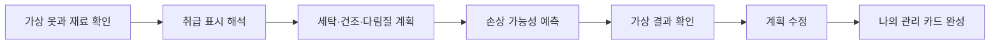

# Laundry Symbol Rescue Team

> 한국어 서비스명: **세탁표시 구조대**  
> 문서 상태: 설계 확정 전 검토본 · 구현하지 않음  
> 작성일: 2026-08-26

## 1. 프로젝트 개요

| 항목 | 설계 내용 |
|---|---|
| 대상 | 초등 5~6학년 중심, 3~4학년 단순화 가능 |
| 교과 | 실과 |
| 핵심 질문 | 옷의 재료와 취급 표시를 함께 읽으면 손상을 줄이는 관리 순서를 어떻게 정할 수 있을까요? |
| 한 차시 권장 시간 | 25~35분 |
| 실행 형태 | 가상 의류·학습용 표시를 사용하는 정적 웹앱 |
| 핵심 산출물 | 표시 해석표, 세탁·건조·다림질 계획, 손상 예측과 수정 근거 |

학생은 가상 옷의 재료 정보와 취급 표시를 관찰한 뒤 세탁, 건조, 다림질 단계를 선택합니다. 표시 하나를 외우는 퀴즈보다 **여러 표시가 하나의 관리 과정에 함께 적용된다는 점**과 잘못된 선택이 어떤 손상 가능성을 높이는지 설명하는 데 초점을 둡니다.

## 2. 설계 원칙

- 실제 옷에서는 해당 제품 라벨과 보호자·교사의 안내를 우선해야 함을 분명히 합니다.
- 세탁 기호의 모양·의미는 구현 전에 최신 KS·ISO 및 공신력 있는 국내 안내 자료로 검수합니다.
- 검수되지 않은 기호를 실제 표준처럼 제시하지 않으며 설계 단계에서는 의미 범주만 정의합니다.
- 세제 혼합, 표백제 사용량, 뜨거운 다리미 조작 등 위험한 실제 절차를 학생에게 지시하지 않습니다.
- 옷 손상을 겁주는 활동이 아니라 자원 절약과 안전한 돌봄의 관점으로 구성합니다.

## 3. 교육과정 연계와 학습 목표

- `[6실02-07]`: 의생활 물품이 만들어지는 과정과 구성 원리 탐색
- `[6실02-09]`: 의생활에서 발생하는 문제를 탐색하고 해결하기
- 자원 절약, 수선·관리, 지속가능한 생활과 연계

| 수준 | 학습 목표 |
|---|---|
| 이해 | 재료와 취급 표시가 관리 방법을 결정하는 정보임을 설명합니다. |
| 적용 | 표시 범주에 맞는 세탁·건조·다림질 선택을 합니다. |
| 분석 | 여러 표시가 동시에 있을 때 서로 모순되지 않는 관리 순서를 찾습니다. |
| 평가 | 손상 가능성, 안전, 자원 사용을 고려해 계획을 수정합니다. |

## 4. 기존 앱과의 차별성

| 비교 대상 | 기존 앱의 중심 | 이 앱의 고유 중심 |
|---|---|---|
| 날씨 옷차림 앱 | 날씨 조건에 맞는 옷 선택 | 의류 재료와 취급 표시를 읽어 관리 순서 결정 |
| 생활도구 리디자인 클리닉 | 도구의 불편과 기능 개선 | 이미 있는 의류를 손상 없이 관리하는 정보 해석 |
| 친환경 소비·시장 앱 | 가격과 구매 판단 | 세탁·건조·다림질 과정과 자원 절약 |

## 5. 핵심 학습 흐름

## 6. 표시 범주와 콘텐츠 검수

MVP는 공식 출처 검수가 끝난 뒤 다음 범주에서 6~8개 핵심 표시만 선정합니다.

| 범주 | 학습 질문 | 설계상 주의 |
|---|---|---|
| 세탁 | 물세탁 가능 여부와 강도·온도 조건은 무엇인가 | 숫자·선의 의미를 공식 자료와 대조 |
| 표백 | 표백 가능 여부는 무엇인가 | 특정 화학제품 사용법을 지시하지 않음 |
| 건조 | 자연 건조와 기계 건조 중 어떤 조건인가 | 실제 기기 설정을 대신하지 않음 |
| 다림질 | 다림질 가능 여부와 열 조건은 무엇인가 | 학생에게 실제 뜨거운 기구 사용을 권하지 않음 |
| 전문 관리 | 가정에서 처리하지 말아야 하는가 | 보호자·전문가에게 맡기는 선택 인정 |

공식 표기와 다르게 단순화한 아이콘을 쓸 경우 `학습용 아이콘`으로 명확히 구분하고 실제 라벨 모양을 대체하지 않습니다.

## 7. 가상 의류 미션

| 미션 | 가상 물품 | 판단 초점 |
|---|---|---|
| 1. 기본 티셔츠 | 면 중심 재료 | 세탁과 건조 표시를 함께 읽기 |
| 2. 포근한 목도리 | 민감한 섬유 모형 | 강한 세탁·열을 피해야 하는 근거 찾기 |
| 3. 운동복 | 합성 섬유 모형 | 재료 특성과 낮은 열 조건 비교 |
| 4. 장식이 있는 옷 | 장식 부착 가상 물품 | 옷 전체의 가장 제한적인 조건 적용 |
| 5. 섞어 빨기 판단 | 서로 다른 가상 옷 3벌 | 한 번에 관리 가능한 조합과 분리할 물품 찾기 |

재료 특성도 실제 성능을 정밀하게 보장하지 않는 학습용 범주로 표현합니다.

## 8. 화면 및 정보 구조

| 화면 | 주요 요소 | 학생 행동 |
|---|---|---|
| 구조 요청 | 가상 옷 그림, 재료, 오염 상황 | 라벨 확인 |
| 표시 확대경 | 표시, 글 설명, 용어 도움 | 뜻 후보 선택 |
| 관리 순서판 | 세탁·건조·다림질 단계 | 방법 카드 선택 |
| 손상 예보 | 줄어듦·변형·색 변화 등의 가능성 카드 | 결과 예측 |
| 가상 관리 | 단계별 전후 비교와 제한 안내 | 문제 단계 찾기 |
| 구조 보고서 | 최초·수정 계획, 실제 라벨 우선 안내 | 관리 카드 완성 |

카드 이동은 `카드 선택 → 단계 선택` 방식으로 대체할 수 있어야 합니다.

## 9. 시뮬레이션·판정 규칙

- 각 가상 의류는 재료 범주, 검수된 표시 ID, 허용 관리 조건을 가집니다.
- 학생 계획은 단계별 조건이 모든 표시의 제한 범위에 들어오는지 검사합니다.
- 잘못된 선택은 확정적 손상이라고 단정하지 않고 `손상 가능성이 커짐`과 그 근거를 보여 줍니다.
- 여러 옷을 함께 관리하는 미션에서는 가장 제한적인 조건과 분리 필요 여부를 비교합니다.
- 에너지·물 사용은 정밀 단위가 아닌 상대 지표로만 표현합니다.
- 실제 제품 라벨과 제조사 안내가 앱보다 우선한다는 문구를 결과마다 표시합니다.

## 10. 피드백과 평가

| 평가 요소 | 성취 증거 |
|---|---|
| 표시 해석 | 기호의 의미 범주를 관리 행동과 연결함 |
| 종합 판단 | 한 표시만 보지 않고 여러 제한을 함께 적용함 |
| 손상 추론 | 선택한 조건과 예상 손상을 근거로 연결함 |
| 책임 있는 관리 | 안전·자원 절약·도움 요청을 함께 고려함 |

오답 피드백은 위험한 실제 시범을 보여 주지 않고 “이 표시에서 허용하는 열 조건을 다시 확인하세요”처럼 라벨로 되돌아가게 합니다.

## 11. UI·접근성 설계

- 기호 옆에 항상 짧은 문자 설명을 제공하고 기호만 암기하도록 하지 않습니다.
- 선 굵기와 작은 점의 차이가 중요한 표시는 확대 보기와 고대비 모드를 제공합니다.
- 현재 필수 버튼 `표시 확대`, `관리 계획 확인`에만 `gi-pulse`를 적용합니다.
- 모션 감소 설정에서는 옷 변형 애니메이션을 전후 그림과 설명으로 대체합니다.
- 모든 선택은 버튼·키보드로 가능하며 최소 44px 터치 영역을 사용합니다.
- 스크린 리더가 기호 이름, 허용 여부, 현재 계획을 문자로 읽을 수 있게 합니다.

## 12. 기술 구조 설계

- Vite + React + TypeScript 기반 정적 SPA를 권장합니다.
- 공식 출처 메타데이터, 표시 정의, 의류 미션, 판정 규칙, UI를 분리합니다.
- 각 표시 데이터에 출처명, 검수일, 적용 범위를 기록할 필드를 둡니다.
- 서버, 로그인, 카메라 라벨 인식, 외부 AI, 제품 추천·광고를 사용하지 않습니다.
- 학생 계획은 기본적으로 현재 탭에만 보관합니다.

## 13. 안전·개인정보·표준 한계

- 실제 다리미, 뜨거운 물, 표백제, 세탁기 조작을 학생 혼자 수행하도록 안내하지 않습니다.
- 사진이나 브랜드 라벨을 업로드받지 않습니다.
- 국가·시기·제품에 따라 표시와 안내가 다를 수 있으므로 공식 출처 검수일을 공개합니다.
- 앱은 실제 의류 손상이나 안전을 보증하는 전문 서비스가 아닙니다.
- 모르는 표시가 있으면 보호자·교사 또는 제품의 공식 안내에 확인하도록 합니다.

## 14. MVP 범위

### 포함

- 공식 검수된 핵심 표시 6~8개
- 가상 의류 미션 5개
- 표시 해석, 관리 순서, 손상 가능성 예측, 수정
- 공식 출처·검수일 표시와 실제 라벨 우선 안내

### 제외

- 카메라 기반 라벨 인식
- 실제 세제·세탁기 제품별 사용법
- 얼룩 제거 화학 지침
- 온라인 계정, 구매 링크, AI 자동 판정

## 15. 완료 기준

- 공개되는 모든 표시가 권위 있는 최신 출처와 검수일에 연결됩니다.
- 실제 표준 기호와 학습용 아이콘을 혼동하지 않게 표시합니다.
- 학생이 표시 해석, 계획, 손상 예측, 수정의 네 단계를 모두 경험합니다.
- 실제 위험 행동을 직접 지시하거나 손상 결과를 확정적으로 보장하지 않습니다.
- 375px 모바일, 키보드, 확대 200%, 고대비, 모션 감소 환경에서 완료할 수 있습니다.

## 16. 업데이트 내역 버튼 설계

화면 오른쪽 아래의 작은 `업데이트 내역` 버튼에 표시 출처 검수일, 콘텐츠 수정, 안전 문구 변경을 남깁니다.

| 날짜 | 구분 | 내역 |
|---|---|---|
| 2026-08-26 | 설계 | 최초 설계 문서 작성 |
| 구현일 입력 예정 | 개발 | 공식 표시 검수와 MVP 구현 완료 후 실제 날짜 기록 |

## 17. 이번 문서의 경계

이번 문서는 제품·교육 설계와 표준 검수 절차만 정의합니다. 실제 기호 자료 확정, 코드, 카메라 기능, 테스트, 배포, 서비스 등록은 진행하지 않습니다.
