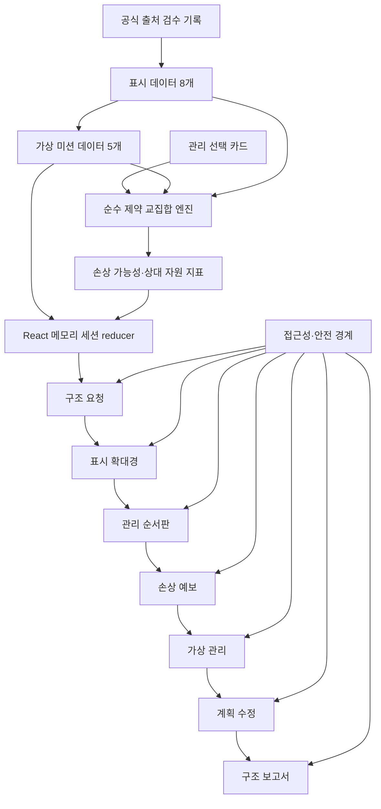

# Laundry Symbol Rescue Team Implementation Plan

> **For agentic workers:** REQUIRED SUB-SKILL: Use superpowers:subagent-driven-development (recommended) or superpowers:executing-plans to implement this plan task-by-task. Steps use checkbox (`- [ ]`) syntax for tracking.
>
> **실행 경계:** 이 문서는 구현 순서와 향후 실행할 명령만 정의한다. 이 문서를 작성하는 단계에서는 소스·설정·테스트 파일 생성, 패키지 설치, Git 초기화, 커밋, 푸시, 배포를 실행하지 않는다.

**Goal:** 초등 5~6학년 학생이 검수된 의류 취급 표시와 가상 재료 정보를 함께 읽고, 세탁·건조·다림질 계획을 세운 뒤 손상 가능성을 예측하고 수정 근거가 담긴 관리 카드를 완성하는 정적 교육용 웹앱을 구축한다.

**Architecture:** Vite 기반 React + TypeScript 정적 SPA로 구성하고, 공식 출처 메타데이터·표시 정의·미션 데이터·순수 판정 함수·세션 상태·화면 UI를 분리한다. 판정 엔진은 정답을 화면에 하드코딩하지 않고 검수된 표시 제약의 교집합을 계산하며, 학생 진행 상태는 React 메모리에만 유지하여 현재 탭을 벗어나 저장되지 않게 한다. 모든 화면은 클릭/키보드 기반의 단방향 학습 흐름을 공유하고, 서버·로그인·카메라·외부 AI·제품 추천 없이 정적 빌드만 배포한다.

**Tech Stack:** npm, Vite, React, TypeScript strict mode, semantic HTML, 로컬 SVG와 순수 CSS, Vitest, React Testing Library, `@testing-library/user-event`, Playwright, `@axe-core/playwright`, ESLint, GitHub Pages Actions

**Spec:** `/Volumes/ External Drive 256G/Dev2/codex/laundry-symbol-rescue-team/2026-08-26-laundry-symbol-rescue-team-design.md`

## Global Constraints

- 대상은 초등 5~6학년이며, 문장은 짧고 쉬운 한국어로 작성해 3~4학년도 교사 안내와 함께 사용할 수 있게 한다.
- 실과 `[6실02-07]`과 `[6실02-09]`에 연결하고 자원 절약, 수선·관리, 지속가능한 생활의 관점을 구조 보고서와 교사용 README에 명시한다.
- 한 미션의 권장 학습 시간은 25~35분 안에 표시 해석, 관리 계획, 손상 예측, 계획 수정, 관리 카드 완성을 모두 경험할 수 있는 분량으로 제한한다.
- 학습의 중심은 표시 암기가 아니라 `재료 확인 → 여러 표시 해석 → 세탁·건조·다림질 계획 → 손상 가능성 예측 → 가상 결과 → 수정 → 관리 카드`의 종합 판단이다.
- 날씨에 맞는 옷 선택, 생활도구 기능 개선, 가격·구매 판단을 넣지 않고 기존 앱과의 차별점인 `이미 있는 의류의 재료와 취급 표시를 읽어 관리 순서를 정하는 활동`에만 집중한다.
- 공개 표시 수는 정확히 8개, 가상 의류 미션 수는 정확히 5개로 한다. 8개 표시는 공식 출처 검수 게이트를 통과해야 공개할 수 있다.
- 표시의 모양·의미는 구현 시점의 최신 KS·ISO와 공신력 있는 국내 공식 안내를 대조한다. 출처명, 공식 URL, 표준 번호 또는 문서 식별자, 적용 범위, 검수일을 각 표시와 연결한다.
- 실제 표준 기호를 사용하면 `공식 취급 표시`, 단순화한 표현을 사용하면 `학습용 아이콘`이라고 문자로 명시한다. 검수 또는 이용 근거가 없는 기호·도형은 공개 데이터에 넣지 않는다.
- 가상 재료 특성은 실제 성능을 정밀하게 보장하지 않는 `학습용 재료 모형`으로 표시한다.
- 판정 문구는 손상을 확정하지 않고 `손상 가능성이 커질 수 있어요`처럼 가능성과 근거를 설명한다.
- 에너지와 물 사용은 `낮음·보통·높음` 상대 지표만 사용하고 수치·비용·절감률을 계산하지 않는다.
- 모든 결과 화면에 `실제 옷에서는 제품 라벨과 제조사 안내, 보호자·교사의 안내를 먼저 확인하세요.`를 표시한다.
- 실제 다리미, 뜨거운 물, 표백제, 세탁기 조작을 학생 혼자 수행하도록 지시하지 않는다. 세제 혼합량, 표백제 사용량, 기기별 조작 순서를 제공하지 않는다.
- 서버, 로그인, 카메라 입력, 사진·브랜드 라벨 업로드, 외부 AI, 온라인 계정, 구매 링크, 광고, 제품별 사용법, 얼룩 제거 화학 지침을 구현하지 않는다.
- 학생 이름, 학급, 사진, 브랜드, 자유 서술 개인정보를 입력받지 않는다. 진행 상태는 React 메모리에만 저장하며 `localStorage`, `sessionStorage`, 쿠키, 원격 분석을 사용하지 않는다.
- 카드 이동은 드래그 앤 드롭 없이 `카드 선택 → 단계 선택` 버튼 흐름으로 완전히 수행할 수 있어야 한다.
- 모든 선택은 키보드로 가능해야 하며 대화상자 포커스 복귀, 현재 단계 안내, 결과 `aria-live` 알림을 제공한다.
- 모든 조작 요소의 최소 터치 영역은 `44px × 44px`이다.
- 기호 옆에는 항상 짧은 문자 설명을 제공하고, 작은 점·선 차이를 확인할 수 있는 확대 보기와 앱 내 고대비 모드를 제공한다.
- `gi-pulse`는 현재 필수 행동인 `표시 확대`와 `관리 계획 확인` 버튼에만 적용한다. 다른 버튼에는 적용하지 않는다.
- `prefers-reduced-motion: reduce`에서는 `gi-pulse`와 옷 변형 애니메이션을 제거하고, `필수` 배지와 정적인 전후 그림·문자 설명으로 정보를 보존한다.
- 375px 모바일, 키보드 전용, 브라우저 확대 200%, 고대비, 모션 감소, 스크린 리더 환경에서 첫 미션부터 구조 보고서까지 완료할 수 있어야 한다.
- 화면 오른쪽 아래에 작은 `업데이트 내역` 버튼을 두고 2026-08-26 설계 기록, 구현일, 표시 출처 검수일, 콘텐츠·안전 문구 변경을 기록한다. 이후 사용자에게 보이는 변경 커밋에는 같은 파일에 날짜와 요약을 추가한다.
- 단일 소스 파일은 500줄 미만으로 유지한다. 450줄에 도달하면 같은 변경에서 책임별 파일로 분리하고, 테스트 파일도 500줄 미만으로 나눈다.
- 설계 문서가 패키지 버전 하한을 지정하지 않았으므로 실행 시 호환되는 현재 패키지를 설치한 뒤 `package-lock.json`으로 정확한 해석 버전을 고정한다.

---

## Scope and learning contract

### 포함 범위

1. 검수 완료 상태인 핵심 표시 8개와 출처·검수일 공개
2. 기본 티셔츠, 포근한 목도리, 운동복, 장식이 있는 옷, 섞어 빨기 판단의 5개 가상 미션
3. 표시 뜻 후보 선택과 문자 해설
4. 세탁·건조·다림질 계획 및 추가 제한 확인
5. 여러 표시의 제약 교집합과 혼합 의류 분리 판단
6. 줄어듦·변형·색 변화·장식 손상·열 손상의 상대적 가능성 예측
7. 가상 결과 확인, 라벨로 돌아가는 피드백, 수정 계획
8. 최초 계획과 수정 계획, 근거, 책임 있는 관리 행동을 보여 주는 구조 보고서
9. 접근성, 개인정보·안전 경계, 정적 빌드와 공개 전 검증

### 제외 범위

- 카메라 라벨 인식, OCR, 실제 제품 사진 분석
- 실제 세제·표백제·세탁기·다리미 제품별 사용 지침
- 실측 재료 성능, 손상 확률, 에너지·물의 정밀 수치
- 로그인, 서버 데이터베이스, 학급 관리, 사용자 이름 입력, 클라우드 저장
- 구매 링크, 광고, 제품 추천, AI 자동 판정
- HVC 등록이나 별도 서비스 카탈로그 연동

### 성취 증거

| 학습 목표 | 앱에서 수집하는 현재 탭 내 증거 | 합격 조건 |
|---|---|---|
| 이해 | `SymbolInterpretationAttempt[]` | 미션의 모든 표시에서 문자 설명을 확인하고 올바른 뜻 후보에 도달한다. |
| 적용 | `initialPlan.stageOptions` | 세탁·건조·다림질 세 단계에 모두 선택이 있다. |
| 분석 | `PlanEvaluation.findings`, `GroupingChoice` | 모든 표시의 제한을 함께 확인하고 혼합 미션에서 분리 근거를 고른다. |
| 평가 | `PredictionSelection`, `revisedPlan` | 손상 가능성과 관련 표시를 연결하고 최초 계획을 한 번 이상 검토한다. |
| 책임 있는 관리 | `acknowledgedRestrictionIds`, 보고서 안전 문구 | 안전·자원 상대 지표·도움 요청·실제 라벨 우선을 함께 확인한다. |

## Architecture map



## Expected file structure and responsibilities

현재 프로젝트 루트에는 설계 문서만 있고 Git 저장소가 아니다. 아래 구조는 실행 시 생성할 정확한 목표 구조다.

```text
laundry-symbol-rescue-team/
├── .github/workflows/deploy-pages.yml          # 승인 후 GitHub Pages 정적 배포
├── docs/
│   ├── content-review/2026-08-26-symbol-source-audit.md
│   └── release-checklist.md
├── e2e/
│   ├── accessibility.spec.ts
│   ├── learner-flow.spec.ts
│   ├── responsive.spec.ts
│   └── safety-boundaries.spec.ts
├── public/
│   ├── app-icon.svg
│   └── symbols/
│       ├── care-wash-30-gentle.svg
│       ├── care-no-bleach.svg
│       ├── care-flat-dry.svg
│       ├── care-tumble-low.svg
│       ├── care-no-tumble.svg
│       ├── care-iron-low.svg
│       ├── care-no-iron.svg
│       └── care-professional.svg
├── src/
│   ├── app/
│   │   ├── AppShell.tsx
│   │   ├── LearnerSessionProvider.tsx
│   │   └── useLearnerSession.ts
│   ├── components/ui/
│   │   ├── ActionButton.tsx
│   │   ├── AppDialog.tsx
│   │   ├── HighContrastToggle.tsx
│   │   ├── ProgressIndicator.tsx
│   │   ├── SafetyNotice.tsx
│   │   └── SymbolFigure.tsx
│   ├── content/
│   │   ├── careOptions.test.ts
│   │   ├── careOptions.ts
│   │   ├── missions.test.ts
│   │   ├── missions.ts
│   │   ├── sources.ts
│   │   ├── symbols.test.ts
│   │   ├── symbols.ts
│   │   ├── updateHistory.test.ts
│   │   ├── updateHistory.ts
│   │   ├── validateContent.test.ts
│   │   └── validateContent.ts
│   ├── domain/
│   │   ├── careTypes.ts
│   │   ├── evaluateGrouping.test.ts
│   │   ├── evaluateGrouping.ts
│   │   ├── evaluateInterpretation.test.ts
│   │   ├── evaluateInterpretation.ts
│   │   ├── evaluatePlan.test.ts
│   │   ├── evaluatePlan.ts
│   │   ├── evaluatePrediction.test.ts
│   │   ├── evaluatePrediction.ts
│   │   ├── evaluationTypes.ts
│   │   ├── validatePlanInput.ts
│   │   ├── missionTypes.ts
│   │   ├── sessionReducer.test.ts
│   │   └── sessionReducer.ts
│   ├── features/
│   │   ├── forecast/DamageForecastScreen.tsx
│   │   ├── forecast/RiskCard.tsx
│   │   ├── magnifier/CareSymbolCard.tsx
│   │   ├── magnifier/SymbolMagnifierScreen.tsx
│   │   ├── mission/MissionPicker.tsx
│   │   ├── mission/RescueRequestScreen.tsx
│   │   ├── plan/CareOptionCard.tsx
│   │   ├── plan/CurrentPlanSummary.tsx
│   │   ├── plan/ManagementBoardScreen.tsx
│   │   ├── report/ManagementCard.tsx
│   │   ├── report/RescueReportScreen.tsx
│   │   ├── revision/RevisionScreen.tsx
│   │   ├── simulation/BeforeAfterComparison.tsx
│   │   ├── simulation/VirtualCareScreen.tsx
│   │   ├── updates/UpdateHistoryButton.tsx
│   │   └── updates/UpdateHistoryDialog.tsx
│   ├── styles/
│   │   ├── accessibility.css
│   │   ├── base.css
│   │   ├── layout.css
│   │   ├── motion.css
│   │   └── tokens.css
│   ├── test/
│   │   ├── app-flow.test.tsx
│   │   ├── factories.ts
│   │   ├── renderApp.tsx
│   │   ├── safety-boundaries.test.tsx
│   │   └── setup.ts
│   ├── App.test.tsx
│   ├── App.tsx
│   └── main.tsx
├── .gitignore
├── eslint.config.js
├── index.html
├── package-lock.json
├── package.json
├── playwright.config.ts
├── README.md
├── tsconfig.app.json
├── tsconfig.json
├── tsconfig.node.json
├── vite.config.ts
└── vitest.config.ts
```

### File-size budget

| 파일 종류 | 목표 상한 | 분리 기준 |
|---|---:|---|
| 도메인 함수 | 220줄 | 판정 종류별 파일로 분리 |
| 콘텐츠 데이터 | 320줄 | 출처, 표시, 미션, 선택 카드별 파일 유지 |
| 화면 컴포넌트 | 280줄 | 카드·요약·대화상자를 하위 컴포넌트로 분리 |
| CSS | 300줄 | 토큰, 배치, 접근성, 모션 책임별 분리 |
| 단위·통합 테스트 | 400줄 | 도메인 또는 사용자 흐름별 분리 |
| E2E 테스트 | 350줄 | 학습 흐름, 접근성, 반응형, 안전 경계별 분리 |

어떤 파일도 500줄에 도달하게 두지 않는다. `wc -l` 검사에서 450줄 이상인 파일은 최종 커밋 전에 책임별로 분리한다.

## Stable domain contracts

아래 이름과 필드가 작업 간 계약이다. 구현 중 다른 이름으로 바꾸면 이 문서의 모든 소비 지점과 테스트를 같은 커밋에서 함께 갱신한다.

```ts
export type CareStage = 'wash' | 'bleach' | 'dry' | 'iron' | 'professional';
export type PlanningStage = 'wash' | 'dry' | 'iron';
export type RelativeLevel = 'lower' | 'medium' | 'higher';
export type ReviewStatus = 'pending' | 'approved' | 'rejected';
export type DisplayKind = 'official-standard-symbol' | 'learning-icon';

export type CareSymbolId =
  | 'care-wash-30-gentle'
  | 'care-no-bleach'
  | 'care-flat-dry'
  | 'care-tumble-low'
  | 'care-no-tumble'
  | 'care-iron-low'
  | 'care-no-iron'
  | 'care-professional';

export type CareOptionId =
  | 'plan-wash-gentle-30'
  | 'plan-wash-strong-40'
  | 'plan-wash-pause-and-ask'
  | 'plan-dry-flat'
  | 'plan-dry-line'
  | 'plan-dry-tumble-low'
  | 'plan-dry-tumble-high'
  | 'plan-dry-pause-and-ask'
  | 'plan-iron-none'
  | 'plan-iron-low-with-adult'
  | 'plan-iron-high-with-adult'
  | 'plan-iron-pause-and-ask';

export type DamageRiskId =
  | 'shrinkage'
  | 'deformation'
  | 'color-change'
  | 'decoration-damage'
  | 'heat-damage';

export type MissionId =
  | 'basic-t-shirt'
  | 'soft-scarf'
  | 'sportswear'
  | 'decorated-top'
  | 'mixed-load';

export type SessionStep =
  | 'request'
  | 'magnifier'
  | 'plan'
  | 'forecast'
  | 'simulation'
  | 'revision'
  | 'report';

export interface MeaningOption {
  id: string;
  label: string;
}
```

핵심 함수 서명은 다음과 같다.

```ts
export function validatePublishedContent(input: {
  sources: readonly SourceRecord[];
  symbols: readonly CareSymbol[];
}): readonly ContentValidationIssue[];

export function evaluateInterpretation(input: {
  symbol: CareSymbol;
  selectedMeaningOptionId: string;
}): InterpretationFeedback;

export function evaluatePlan(input: {
  mission: GarmentMission;
  plan: StudentPlan;
  symbols: ReadonlyMap<CareSymbolId, CareSymbol>;
  options: ReadonlyMap<CareOptionId, CareOption>;
}): PlanEvaluation;

export function resolveGarmentAllowedOptions(input: {
  garment: VirtualGarment;
  symbols: ReadonlyMap<CareSymbolId, CareSymbol>;
  options: ReadonlyMap<CareOptionId, CareOption>;
}): Readonly<Record<PlanningStage, readonly CareOptionId[]>>;

export function evaluateGrouping(input: {
  mission: GarmentMission;
  grouping: GroupingChoice;
  symbols: ReadonlyMap<CareSymbolId, CareSymbol>;
  options: ReadonlyMap<CareOptionId, CareOption>;
}): GroupingEvaluation;

export function evaluatePrediction(input: {
  evaluation: PlanEvaluation;
  selection: PredictionSelection;
}): PredictionFeedback;

export function sessionReducer(
  state: LearnerSession,
  action: SessionAction,
): LearnerSession;
```

## Task dependency order

```mermaid
flowchart LR
    T1[1 기반 구성] --> T2[2 출처·표시 검수]
    T2 --> T3[3 선택·미션 데이터]
    T3 --> T4[4 해석·계획 판정]
    T4 --> T5[5 혼합·예측 판정]
    T5 --> T6[6 세션 상태]
    T6 --> T7[7 앱 셸·구조 요청]
    T7 --> T8[8 표시 확대경]
    T8 --> T9[9 관리 순서판]
    T9 --> T10[10 손상 예보]
    T10 --> T11[11 가상 결과·수정]
    T11 --> T12[12 보고서·업데이트]
    T12 --> T13[13 접근성]
    T13 --> T14[14 안전·개인정보]
    T14 --> T15[15 통합·릴리스]
```



### Task 1: Establish the static React test foundation

**Files:**
- Create: `.gitignore`
- Create: `package.json`
- Create: `package-lock.json`
- Create: `index.html`
- Create: `tsconfig.json`
- Create: `tsconfig.app.json`
- Create: `tsconfig.node.json`
- Create: `vite.config.ts`
- Create: `vitest.config.ts`
- Create: `eslint.config.js`
- Create: `src/test/setup.ts`
- Create: `src/App.test.tsx`
- Create: `src/App.tsx`
- Create: `src/main.tsx`
- Create: `src/styles/tokens.css`
- Create: `src/styles/base.css`

**Interfaces:**
- Consumes: 확정 설계 문서와 Global Constraints.
- Produces: `App(): JSX.Element`, `npm run dev`, `npm run lint`, `npm run typecheck`, `npm run test`, `npm run build`, `npm run check` 스크립트와 `jsdom` 테스트 환경.

- [ ] **Step 1: 실행 전 상태를 확인하고 Git 저장소를 초기화한다**

  Run:

  ```bash
  pwd
  rg --files | sort
  git init -b main
  ```

  Expected: 경로가 프로젝트 루트이고 두 Markdown 문서만 보인 뒤, 빈 `main` 저장소가 생성된다. 기존 파일은 삭제하거나 이동하지 않는다.

- [ ] **Step 2: 패키지 기반과 검사 도구를 설치한다**

  Run:

  ```bash
  npm init -y
  npm install react@latest react-dom@latest
  npm install -D vite@latest @vitejs/plugin-react@latest typescript@latest @types/react@latest @types/react-dom@latest vitest@latest jsdom@latest @testing-library/react@latest @testing-library/jest-dom@latest @testing-library/user-event@latest eslint@latest @eslint/js@latest typescript-eslint@latest eslint-plugin-react-hooks@latest eslint-plugin-react-refresh@latest
  ```

  Expected: `package.json`과 `package-lock.json`이 생성되고 감사 결과에 설치 실패가 없다. 실행자는 생성된 lockfile을 이후 커밋에서 유지한다.

- [ ] **Step 3: 앱 셸의 실패 테스트와 설정 파일을 작성한다**

  `package.json`의 scripts를 다음 값으로 정한다.

  ```json
  {
    "scripts": {
      "dev": "vite",
      "lint": "eslint .",
      "typecheck": "tsc -b --pretty false",
      "test": "vitest run",
      "test:watch": "vitest",
      "build": "tsc -b && vite build",
      "check": "npm run lint && npm run typecheck && npm run test && npm run build"
    }
  }
  ```

  `.gitignore`는 다음 항목만으로 시작한다.

  ```gitignore
  node_modules/
  dist/
  coverage/
  playwright-report/
  test-results/
  .DS_Store
  *.local
  ```

  `tsconfig.app.json`은 `strict`, `noUncheckedIndexedAccess`, `exactOptionalPropertyTypes`, `noFallthroughCasesInSwitch`, `noEmit`을 `true`로 설정한다. `vitest.config.ts`는 `environment: 'jsdom'`, `setupFiles: ['./src/test/setup.ts']`, CSS 활성화를 지정하고, `src/test/setup.ts`는 `@testing-library/jest-dom/vitest`를 import한다. `vite.config.ts`는 React plugin만 사용하며 외부 런타임 script나 CDN을 추가하지 않는다.

  `src/App.test.tsx`:

  ```tsx
  import { render, screen } from '@testing-library/react';
  import { describe, expect, it } from 'vitest';
  import { App } from './App';

  describe('App', () => {
    it('shows the Korean service name and real-label priority notice', () => {
      render(<App />);
      expect(screen.getByRole('heading', { name: '세탁표시 구조대' })).toBeInTheDocument();
      expect(screen.getByText(/실제 옷에서는 제품 라벨과 제조사 안내/)).toBeInTheDocument();
    });
  });
  ```

- [ ] **Step 4: 테스트를 실행해 구현 부재로 실패하는지 확인한다**

  Run: `npm test -- src/App.test.tsx`

  Expected: FAIL. `src/App.tsx`가 아직 없거나 `App` export를 찾을 수 없다는 메시지가 나온다.

- [ ] **Step 5: 최소 정적 앱 셸을 구현한다**

  `src/App.tsx`:

  ```tsx
  export function App() {
    return (
      <main>
        <h1>세탁표시 구조대</h1>
        <p>가상 옷의 재료와 취급 표시를 함께 읽어 관리 순서를 정해 보세요.</p>
        <p>실제 옷에서는 제품 라벨과 제조사 안내, 보호자·교사의 안내를 먼저 확인하세요.</p>
      </main>
    );
  }
  ```

  `src/main.tsx`는 `createRoot`로 `App`을 렌더링하고 `tokens.css`, `base.css`만 import한다. `index.html`의 `<html lang="ko">`, viewport meta, 서비스명을 설정한다.

- [ ] **Step 6: 기반 검사를 통과시킨다**

  Run:

  ```bash
  npm run lint
  npm run typecheck
  npm test -- src/App.test.tsx
  npm run build
  ```

  Expected: lint 오류 0개, TypeScript 오류 0개, App 테스트 1개 PASS, `dist/index.html` 생성.

- [ ] **Step 7: 기반 커밋을 만든다**

  ```bash
  git add .gitignore package.json package-lock.json index.html tsconfig.json tsconfig.app.json tsconfig.node.json vite.config.ts vitest.config.ts eslint.config.js src/test/setup.ts src/App.test.tsx src/App.tsx src/main.tsx src/styles/tokens.css src/styles/base.css 2026-08-26-laundry-symbol-rescue-team-design.md 2026-08-26-laundry-symbol-rescue-team-implementation-plan.md
  git commit -m "chore: scaffold laundry symbol rescue team"
  ```

  Expected: 첫 커밋이 생성되고 `git status --short`가 비어 있다.

### Task 2: Build the official-source review gate and eight-symbol registry

**Files:**
- Create: `docs/content-review/2026-08-26-symbol-source-audit.md`
- Create: `src/domain/careTypes.ts`
- Create: `src/content/sources.ts`
- Create: `src/content/symbols.ts`
- Create: `src/content/validateContent.ts`
- Create: `src/content/validateContent.test.ts`
- Create: `src/content/symbols.test.ts`
- Create: `public/symbols/care-wash-30-gentle.svg`
- Create: `public/symbols/care-no-bleach.svg`
- Create: `public/symbols/care-flat-dry.svg`
- Create: `public/symbols/care-tumble-low.svg`
- Create: `public/symbols/care-no-tumble.svg`
- Create: `public/symbols/care-iron-low.svg`
- Create: `public/symbols/care-no-iron.svg`
- Create: `public/symbols/care-professional.svg`

**Interfaces:**
- Consumes: `CareStage`, `CareSymbolId`, `CareOptionId`, `DamageRiskId`, 공식 출처에서 확인한 기호 모양·의미·적용 범위.
- Produces: `SourceRecord`, `MeaningOption`, `CareSymbol`, `ContentValidationIssue`, `sources`, `careSymbols`, `careSymbolById`, `validatePublishedContent()`.

  ```ts
  export interface SourceRecord {
    id: string;
    publisher: string;
    title: string;
    officialUrl: string;
    standardOrDocumentId: string;
    editionOrPublishedAt: string;
    accessedAt: string;
    reviewedAt: string;
    coverage: string;
    status: ReviewStatus;
  }

  export interface CareSymbol {
    id: CareSymbolId;
    category: CareStage;
    displayKind: DisplayKind;
    name: string;
    categoryHint: string;
    shortDescription: string;
    accessibleDescription: string;
    assetPath: `/symbols/${string}.svg`;
    sourceIds: readonly string[];
    reviewedAt: string;
    meaningOptions: readonly MeaningOption[];
    correctMeaningOptionId: string;
    allowedOptionIds: readonly CareOptionId[];
    forbiddenOptionIds: readonly CareOptionId[];
    riskIds: readonly DamageRiskId[];
    requiresAcknowledgement: boolean;
  }
  ```

- [ ] **Step 1: 8개 후보 표시의 공식 근거를 조사하고 검수 기록을 완성한다**

  검수 기록에는 아래 8개 내부 ID를 행으로 두고, 각 행에 `기호 범주`, `공식 명칭`, `공식 URL`, `표준 번호/문서 식별자`, `판/게시일`, `접근일`, `검수일`, `페이지·절·도표 위치`, `앱에서 사용하는 의미 범위`, `표시 이미지 이용 근거`, `공식 표시/학습용 아이콘 구분`, `교차 검수 결과`를 실제 근거값으로 기록한다.

  | 내부 ID | 범주 | 학습상 검수 대상 |
  |---|---|---|
  | `care-wash-30-gentle` | 세탁 | 숫자 30과 완화된 세탁 조건의 공식 의미 |
  | `care-no-bleach` | 표백 | 표백 금지의 공식 의미 |
  | `care-flat-dry` | 건조 | 평평하게 펴서 자연 건조하는 조건의 공식 의미 |
  | `care-tumble-low` | 건조 | 낮은 열 조건의 회전식 건조 의미 |
  | `care-no-tumble` | 건조 | 회전식 건조 금지의 공식 의미 |
  | `care-iron-low` | 다림질 | 낮은 열 조건의 공식 의미와 학생 안전 경계 |
  | `care-no-iron` | 다림질 | 다림질 금지의 공식 의미 |
  | `care-professional` | 전문 관리 | 가정 처리 대신 보호자·전문가 확인이 필요한 범위 |

  합격 조건: 모든 행이 최신 공식 1차 출처 하나 이상과 국내 공신력 자료 하나 이상에서 의미가 일치하고, 검수자가 기호 재현 또는 학습용 변형의 이용 근거를 확인한다. 하나라도 의미·도형·이용 근거가 확인되지 않으면 이 작업에서 멈추고 해당 ID와 증거 부족 지점을 사용자에게 보고하며 UI 작업으로 진행하지 않는다.

- [ ] **Step 2: 공개 데이터 검증의 실패 테스트를 작성한다**

  `src/content/validateContent.test.ts`:

  ```ts
  import { describe, expect, it } from 'vitest';
  import { validatePublishedContent } from './validateContent';
  import { sources } from './sources';
  import { careSymbols } from './symbols';

  describe('published care-symbol content', () => {
    it('publishes exactly eight fully reviewed symbols', () => {
      expect(careSymbols).toHaveLength(8);
      expect(validatePublishedContent({ sources, symbols: careSymbols })).toEqual([]);
    });

    it('keeps every correct meaning inside its visible choice list', () => {
      for (const symbol of careSymbols) {
        expect(symbol.meaningOptions.map(({ id }) => id)).toContain(symbol.correctMeaningOptionId);
      }
    });
  });
  ```

- [ ] **Step 3: 검증 테스트가 구현 부재로 실패하는지 확인한다**

  Run: `npm test -- src/content/validateContent.test.ts src/content/symbols.test.ts`

  Expected: FAIL. `validateContent`, `sources`, `symbols` 모듈을 찾을 수 없다는 메시지가 나온다.

- [ ] **Step 4: 타입과 검증 함수를 최소 구현한다**

  `validatePublishedContent()`는 다음 오류 코드를 모두 검사한다.

  ```ts
  export type ContentValidationCode =
    | 'symbol-count'
    | 'duplicate-symbol-id'
    | 'missing-source'
    | 'unapproved-source'
    | 'review-date-mismatch'
    | 'missing-accessible-text'
    | 'missing-display-kind'
    | 'missing-correct-choice'
    | 'empty-constraint-set';

  export interface ContentValidationIssue {
    code: ContentValidationCode;
    symbolId?: CareSymbolId;
    message: string;
  }
  ```

  구현은 표시 수가 8인지, ID가 중복되지 않는지, 모든 `sourceIds`가 승인된 출처를 가리키는지, 표시와 출처 검수일이 맞는지, 문자 대체 설명과 구분 라벨이 있는지, 정답 후보가 선택지에 포함되는지, 허용·금지·추가 확인 제약 중 하나 이상이 있는지 순서대로 검사한다.

- [ ] **Step 5: 검수 기록과 일치하는 데이터와 SVG만 추가한다**

  `sources.ts`에는 검수 문서에서 확인한 실제 문자열만 기록하고, `symbols.ts`는 다음 고정 순서를 사용한다.

  ```ts
  export const careSymbolIds = [
    'care-wash-30-gentle',
    'care-no-bleach',
    'care-flat-dry',
    'care-tumble-low',
    'care-no-tumble',
    'care-iron-low',
    'care-no-iron',
    'care-professional',
  ] as const satisfies readonly CareSymbolId[];

  export const careSymbolById = new Map(
    careSymbols.map((symbol) => [symbol.id, symbol] as const),
  );
  ```

  각 SVG는 검수된 공식 형상을 재현할 수 있는 근거가 있을 때만 `displayKind: 'official-standard-symbol'`로 연결한다. 교육적 단순화가 필요한 경우 SVG와 인접 캡션 모두 `displayKind: 'learning-icon'`으로 기록하고 실제 라벨을 대체하지 않는다는 문장을 넣는다.

- [ ] **Step 6: 콘텐츠 게이트를 통과시킨다**

  Run:

  ```bash
  npm test -- src/content/validateContent.test.ts src/content/symbols.test.ts
  rg -n "officialUrl|reviewedAt|displayKind|sourceIds" src/content docs/content-review
  ```

  Expected: 콘텐츠 테스트 전체 PASS. 검색 결과에서 8개 표시가 승인 출처, 검수일, 표시 구분에 연결되고 빈 문자열이 없다.

- [ ] **Step 7: 출처·표시 커밋을 만든다**

  ```bash
  git add docs/content-review/2026-08-26-symbol-source-audit.md src/domain/careTypes.ts src/content/sources.ts src/content/symbols.ts src/content/validateContent.ts src/content/validateContent.test.ts src/content/symbols.test.ts public/symbols
  git commit -m "feat: add reviewed care symbol registry"
  ```

  Expected: 검수 기록, 데이터, 테스트, 8개 SVG가 하나의 독립 커밋으로 남는다.

### Task 3: Define care choices and the five virtual garment missions

**Files:**
- Create: `src/domain/missionTypes.ts`
- Create: `src/content/careOptions.ts`
- Create: `src/content/careOptions.test.ts`
- Create: `src/content/missions.ts`
- Create: `src/content/missions.test.ts`
- Create: `src/test/factories.ts`

**Interfaces:**
- Consumes: `CareSymbolId`, `CareOptionId`, `DamageRiskId`, Task 2의 `careSymbolById`.
- Produces: `CareOption`, `VirtualGarment`, `GarmentMission`, `StudentPlan`, `GroupingChoice`, `careOptions`, `careOptionById`, `missions`, `missionById`, `makeEmptyPlan()`, 테스트 전용 `makePlanFixture()`.

  ```ts
  export interface CareOption {
    id: CareOptionId;
    stage: PlanningStage;
    label: string;
    learningDescription: string;
    requiresAdult: boolean;
    waterUse: RelativeLevel;
    energyUse: RelativeLevel;
    riskIds: readonly DamageRiskId[];
  }

  export interface VirtualGarment {
    id: string;
    name: string;
    materialModel: string;
    materialBoundary: string;
    contaminationScenario: string;
    symbolIds: readonly CareSymbolId[];
    materialAllowedOptionIdsByStage: Readonly<Record<PlanningStage, readonly CareOptionId[]>>;
  }

  export interface GarmentMission {
    id: MissionId;
    order: 1 | 2 | 3 | 4 | 5;
    title: string;
    learningFocus: string;
    garments: readonly VirtualGarment[];
    requiresGrouping: boolean;
    openingPrompt: string;
  }

  export interface StudentPlan {
    missionId: MissionId;
    garmentIds: readonly string[];
    stageOptions: Readonly<Record<PlanningStage, CareOptionId | null>>;
    acknowledgedRestrictionIds: readonly CareSymbolId[];
    grouping: GroupingChoice | null;
  }

  export interface GroupingChoice {
    togetherGarmentIds: readonly string[];
    separateGarmentIds: readonly string[];
    reasonSymbolIds: readonly CareSymbolId[];
  }

  export type PlanFixtureScenario = 'empty' | 'within-limits' | 'outside-limits';

  export function makeEmptyPlan(missionId: MissionId): StudentPlan;
  export function makePlanFixture(
    missionId: MissionId,
    scenario: PlanFixtureScenario,
  ): StudentPlan;
  ```

- [ ] **Step 1: 선택 카드와 미션 불변조건의 실패 테스트를 작성한다**

  `src/content/missions.test.ts`:

  ```ts
  import { describe, expect, it } from 'vitest';
  import { missions } from './missions';

  describe('virtual garment missions', () => {
    it('contains the five ordered design missions', () => {
      expect(missions.map(({ id }) => id)).toEqual([
        'basic-t-shirt',
        'soft-scarf',
        'sportswear',
        'decorated-top',
        'mixed-load',
      ]);
    });

    it('marks every material claim as a learning model', () => {
      for (const mission of missions) {
        for (const garment of mission.garments) {
          expect(garment.materialBoundary).toMatch(/학습용 재료 모형/);
        }
      }
    });

    it('uses three garments and grouping only in the mixed mission', () => {
      const mixed = missions.find(({ id }) => id === 'mixed-load');
      expect(mixed?.garments).toHaveLength(3);
      expect(mixed?.requiresGrouping).toBe(true);
      expect(missions.filter(({ requiresGrouping }) => requiresGrouping)).toHaveLength(1);
    });
  });
  ```

- [ ] **Step 2: 테스트를 실행해 데이터 모듈 부재로 실패하는지 확인한다**

  Run: `npm test -- src/content/careOptions.test.ts src/content/missions.test.ts`

  Expected: FAIL. `careOptions` 또는 `missions` 모듈을 찾을 수 없다는 메시지가 나온다.

- [ ] **Step 3: 12개 관리 선택 카드를 최소 구현한다**

  `careOptions`는 Stable domain contracts의 12개 `CareOptionId`를 정확히 한 번씩 포함한다. `plan-wash-strong-40`, `plan-dry-tumble-high`, `plan-iron-high-with-adult`는 오개념을 드러내는 가상 비교 선택지이며 실제 기기 조작을 지시하지 않는다. 다림질 관련 모든 실행 가능 선택은 `requiresAdult: true`로 하고, 앱 문구는 학생이 직접 기기를 켜도록 안내하지 않는다.

  `careOptions.test.ts` 합격 조건:

  ```ts
  expect(careOptions).toHaveLength(12);
  expect(new Set(careOptions.map(({ id }) => id)).size).toBe(12);
  expect(careOptions.filter(({ stage }) => stage === 'wash')).toHaveLength(3);
  expect(careOptions.filter(({ stage }) => stage === 'dry')).toHaveLength(5);
  expect(careOptions.filter(({ stage }) => stage === 'iron')).toHaveLength(4);
  expect(careOptions.filter(({ stage }) => stage === 'iron').every(({ requiresAdult }) => requiresAdult)).toBe(true);
  ```

- [ ] **Step 4: 다섯 미션을 정확한 교육 초점으로 구현한다**

  | MissionId | 가상 물품 | 판단 초점 | 필수 콘텐츠 |
  |---|---|---|---|
  | `basic-t-shirt` | 면 중심 기본 티셔츠 | 세탁과 건조 표시 함께 읽기 | 재료 모형, 오염 상황, 세탁·건조 표시 |
  | `soft-scarf` | 민감한 섬유 모형 목도리 | 강한 세탁·열을 피할 근거 | 전문 관리 또는 도움 요청, 열 제한 |
  | `sportswear` | 합성 섬유 모형 운동복 | 재료 특성과 낮은 열 비교 | 상대 열 조건, 자연/기계 건조 판단 |
  | `decorated-top` | 장식 부착 가상 의류 | 가장 제한적인 조건 적용 | 장식 손상 가능성과 여러 제한 |
  | `mixed-load` | 서로 다른 가상 옷 3벌 | 함께 관리 가능한 조합과 분리 | 공통 허용 범위, 분리할 물품, 근거 표시 |

  각 `VirtualGarment.materialAllowedOptionIdsByStage`는 표시와 별개인 학습용 재료 모형의 상대 제약만 기록한다. 표시 제약과의 교집합은 데이터에 미리 복제하지 않고 Task 4의 `evaluatePlan()`이 계산한다. 미션 설명에는 실제 성능 보장이 아니라는 `materialBoundary`를 항상 포함한다.

- [ ] **Step 5: 재사용할 테스트 fixture를 구현한다**

  `src/test/factories.ts`의 `makePlanFixture()`는 미션의 실제 garment ID를 읽고, `empty`는 세 단계가 모두 `null`, `within-limits`는 세 단계가 미션 교집합 안, `outside-limits`는 강한 세탁·높은 건조 열·높은 다림질 열 비교 카드를 선택한 계획을 반환한다. 혼합 미션 fixture는 정확히 3벌을 포함하며, `within-limits`에서는 전문 관리 확인이 필요한 물품을 분리하고 근거 표시를 포함한다.

- [ ] **Step 6: 콘텐츠 테스트를 통과시킨다**

  Run: `npm test -- src/content/careOptions.test.ts src/content/missions.test.ts`

  Expected: 12개 선택 카드, 5개 순서형 미션, 혼합 미션 3벌, 모든 표시·선택 참조 무결성, 모든 재료 경계 문구 테스트 PASS.

- [ ] **Step 7: 미션 데이터 커밋을 만든다**

  ```bash
  git add src/domain/missionTypes.ts src/content/careOptions.ts src/content/careOptions.test.ts src/content/missions.ts src/content/missions.test.ts src/test/factories.ts
  git commit -m "feat: define five virtual garment missions"
  ```

  Expected: 관리 선택과 미션 데이터가 UI 없이 단독 검토 가능한 커밋으로 남는다.

### Task 4: Implement symbol interpretation and multi-constraint plan evaluation

**Files:**
- Create: `src/domain/evaluationTypes.ts`
- Create: `src/domain/validatePlanInput.ts`
- Create: `src/domain/evaluateInterpretation.ts`
- Create: `src/domain/evaluateInterpretation.test.ts`
- Create: `src/domain/evaluatePlan.ts`
- Create: `src/domain/evaluatePlan.test.ts`

**Interfaces:**
- Consumes: `CareSymbol`, `GarmentMission`, `StudentPlan`, `careSymbolById`, `careOptionById`.
- Produces: `InterpretationFeedback`, `PlanFinding`, `PlanEvaluation`, `PlanEvaluationInput`, `PlanInputValidationResult`, `validatePlanInput()`, `evaluateInterpretation()`, `resolveGarmentAllowedOptions()`, `evaluatePlan()`.

  ```ts
  export interface InterpretationFeedback {
    symbolId: CareSymbolId;
    isCorrect: boolean;
    categoryHint: string;
    explanation: string;
    returnPrompt: string;
  }

  export type PlanFindingStatus =
    | 'allowed'
    | 'outside-limit'
    | 'missing-step'
    | 'unread-restriction'
    | 'invalid-input';

  export interface PlanFinding {
    status: PlanFindingStatus;
    stage: PlanningStage | 'restriction';
    garmentIds: readonly string[];
    optionId: CareOptionId | null;
    relatedSymbolIds: readonly CareSymbolId[];
    riskIds: readonly DamageRiskId[];
    feedback: string;
  }

  export interface PlanEvaluation {
    status: 'ready' | 'revise';
    findings: readonly PlanFinding[];
    combinedAllowedOptions: Readonly<Record<PlanningStage, readonly CareOptionId[]>>;
    waterUse: RelativeLevel | null;
    energyUse: RelativeLevel | null;
    safetyNotices: readonly string[];
  }

  export interface PlanEvaluationInput {
    mission: GarmentMission;
    plan: StudentPlan;
    symbols: ReadonlyMap<CareSymbolId, CareSymbol>;
    options: ReadonlyMap<CareOptionId, CareOption>;
  }

  export type PlanInputValidationResult =
    | { valid: true; input: PlanEvaluationInput }
    | { valid: false; message: string };

  export function validatePlanInput(input: unknown): PlanInputValidationResult;
  ```

- [ ] **Step 1: 해석 피드백과 제약 교집합의 실패 테스트를 작성한다**

  `src/domain/evaluatePlan.test.ts`에 다음 핵심 사례를 작성한다.

  ```ts
  it('requires all three planning stages', () => {
    const result = evaluatePlan({
      mission: missionById.get('basic-t-shirt')!,
      plan: makeEmptyPlan('basic-t-shirt'),
      symbols: careSymbolById,
      options: careOptionById,
    });
    expect(result.status).toBe('revise');
    expect(result.findings.filter(({ status }) => status === 'missing-step')).toHaveLength(3);
  });

  it('returns to related labels without claiming certain damage', () => {
    const result = evaluatePlan({
      mission: missionById.get('decorated-top')!,
      plan: makePlanFixture('decorated-top', 'outside-limits'),
      symbols: careSymbolById,
      options: careOptionById,
    });
    const outside = result.findings.filter(({ status }) => status === 'outside-limit');
    expect(outside.length).toBeGreaterThan(0);
    expect(outside.every(({ feedback }) => feedback.includes('표시'))).toBe(true);
    expect(outside.every(({ feedback }) => /가능성/.test(feedback))).toBe(true);
    expect(outside.every(({ feedback }) => !/반드시|확실히/.test(feedback))).toBe(true);
  });
  ```

- [ ] **Step 2: 도메인 테스트를 실행해 함수 부재로 실패하는지 확인한다**

  Run: `npm test -- src/domain/evaluateInterpretation.test.ts src/domain/evaluatePlan.test.ts`

  Expected: FAIL. 두 평가 함수 또는 결과 타입을 찾을 수 없다는 메시지가 나온다.

- [ ] **Step 3: 표시 뜻 후보 평가를 최소 구현한다**

  ```ts
  export function evaluateInterpretation({ symbol, selectedMeaningOptionId }: {
    symbol: CareSymbol;
    selectedMeaningOptionId: string;
  }): InterpretationFeedback {
    const isCorrect = selectedMeaningOptionId === symbol.correctMeaningOptionId;
    return {
      symbolId: symbol.id,
      isCorrect,
      categoryHint: symbol.categoryHint,
      explanation: symbol.shortDescription,
      returnPrompt: isCorrect
        ? '이 표시가 관리 행동과 어떻게 이어지는지 확인해 보세요.'
        : '기호 옆 문자 설명과 허용 조건을 다시 확인하세요.',
    };
  }
  ```

- [ ] **Step 4: 계획 판정을 순수 함수로 최소 구현한다**

  구현 순서:

  1. 각 의류의 `materialAllowedOptionIdsByStage`에서 시작해 해당 의류의 모든 `symbolIds`가 가리키는 `CareSymbol.allowedOptionIds`를 단계별로 교차하고 `forbiddenOptionIds`를 제거한다.
  2. 여러 의류를 함께 관리하면 1번에서 계산한 의류별 허용 집합을 다시 단계별 교집합으로 계산한다.
  3. 비어 있는 단계에는 `missing-step`을 만든다.
  4. 선택한 옵션이 교집합 밖이면 `outside-limit`과 관련 표시 ID·손상 가능성 ID를 만든다.
  5. `requiresAcknowledgement` 표시를 확인하지 않았으면 `unread-restriction`을 만든다.
  6. 모든 필수 항목이 허용 범위이면 `status: 'ready'`, 하나라도 아니면 `status: 'revise'`를 반환한다.
  7. 선택 카드의 상대 지표만 모아 물·에너지 수준을 `lower | medium | higher`로 반환한다. 세 단계 중 하나라도 비었거나 해석 불가능하면 `null`을 반환하며, UI는 `계획을 완성하면 확인할 수 있어요` 문구로 안내한다.
  8. 모든 반환값에 실제 라벨 우선과 보호자·교사 확인 안내를 포함한다.

  교집합 계산은 입력 배열을 변경하지 않고 새 배열을 반환하며, `Date`, 난수, 브라우저 API를 사용하지 않는다.

- [ ] **Step 5: 해석·계획 판정 테스트를 통과시킨다**

  Run: `npm test -- src/domain/evaluateInterpretation.test.ts src/domain/evaluatePlan.test.ts`

  Expected: 정답/오답 해석, 세 단계 누락, 여러 표시 교집합, 추가 제한 미확인, 허용 계획, 가능성 문구, 상대 지표 테스트 전체 PASS.

- [ ] **Step 6: 판정 엔진 커밋을 만든다**

  ```bash
  git add src/domain/evaluationTypes.ts src/domain/validatePlanInput.ts src/domain/evaluateInterpretation.ts src/domain/evaluateInterpretation.test.ts src/domain/evaluatePlan.ts src/domain/evaluatePlan.test.ts
  git commit -m "feat: evaluate symbol meanings and care plans"
  ```

  Expected: UI와 무관한 순수 판정 규칙이 독립 커밋으로 남는다.

### Task 5: Implement mixed-load grouping and damage prediction feedback

**Files:**
- Create: `src/domain/evaluateGrouping.ts`
- Create: `src/domain/evaluateGrouping.test.ts`
- Create: `src/domain/evaluatePrediction.ts`
- Create: `src/domain/evaluatePrediction.test.ts`

**Interfaces:**
- Consumes: `GarmentMission`, `GroupingChoice`, `PlanEvaluation`, `PredictionSelection`, Task 4의 `resolveGarmentAllowedOptions()`와 판정 결과.
- Produces: `GroupingFinding`, `GroupingEvaluation`, `PredictionSelection`, `PredictionFeedback`, `evaluateGrouping()`, `evaluatePrediction()`.

  ```ts
  export interface GroupingEvaluation {
    status: 'ready' | 'revise';
    findings: readonly GroupingFinding[];
    commonAllowedOptions: Readonly<Record<PlanningStage, readonly CareOptionId[]>>;
  }

  export type GroupingFindingCode =
    | 'invalid-membership'
    | 'separation-needed'
    | 'missing-reason'
    | 'compatible-group';

  export interface GroupingFinding {
    code: GroupingFindingCode;
    garmentIds: readonly string[];
    relatedSymbolIds: readonly CareSymbolId[];
    feedback: string;
  }

  export interface PredictionSelection {
    riskIds: readonly DamageRiskId[];
    reasonSymbolIds: readonly CareSymbolId[];
  }

  export interface PredictionFeedback {
    supportedRiskIds: readonly DamageRiskId[];
    unsupportedRiskIds: readonly DamageRiskId[];
    missedRiskIds: readonly DamageRiskId[];
    message: string;
  }
  ```

- [ ] **Step 1: 가장 제한적인 조건과 손상 근거의 실패 테스트를 작성한다**

  ```ts
  it('asks the learner to separate a garment with no shared safe option', () => {
    const mission = missionById.get('mixed-load')!;
    const result = evaluateGrouping({
      mission,
      grouping: {
        togetherGarmentIds: mission.garments.map(({ id }) => id),
        separateGarmentIds: [],
        reasonSymbolIds: [],
      },
      symbols: careSymbolById,
      options: careOptionById,
    });
    expect(result.status).toBe('revise');
    expect(result.findings.some(({ code }) => code === 'separation-needed')).toBe(true);
  });

  it('connects predicted risks to findings rather than certainty', () => {
    const evaluation = evaluatePlan({
      mission: missionById.get('decorated-top')!,
      plan: makePlanFixture('decorated-top', 'outside-limits'),
      symbols: careSymbolById,
      options: careOptionById,
    });
    const result = evaluatePrediction({
      evaluation,
      selection: {
        riskIds: ['heat-damage'],
        reasonSymbolIds: ['care-no-iron'],
      },
    });
    expect(result.supportedRiskIds).toContain('heat-damage');
    expect(result.message).toMatch(/가능성/);
    expect(result.message).not.toMatch(/반드시|확실히/);
  });
  ```

- [ ] **Step 2: 테스트를 실행해 두 함수 부재로 실패하는지 확인한다**

  Run: `npm test -- src/domain/evaluateGrouping.test.ts src/domain/evaluatePrediction.test.ts`

  Expected: FAIL. `evaluateGrouping`과 `evaluatePrediction`을 찾을 수 없다는 메시지가 나온다.

- [ ] **Step 3: 혼합 의류 그룹 판정을 최소 구현한다**

  `evaluateGrouping()`은 다음을 검사한다.

  - `togetherGarmentIds`와 `separateGarmentIds`가 중복 없이 미션의 3벌을 모두 포함하는가.
  - `resolveGarmentAllowedOptions()`의 결과를 사용해 함께 둔 의류 사이에 각 단계의 공통 허용 옵션이 하나 이상 있는가.
  - 전문 관리 또는 도움 요청 표시가 있는 의류가 일반 묶음에서 분리되었는가.
  - `reasonSymbolIds`가 실제 분리 원인이 된 표시를 하나 이상 가리키는가.

  결과 코드는 `invalid-membership | separation-needed | missing-reason | compatible-group` 네 가지로 제한한다.

- [ ] **Step 4: 예측 피드백을 최소 구현한다**

  `evaluatePrediction()`은 `PlanEvaluation.findings[].riskIds`의 합집합을 근거 집합으로 사용한다. 학생이 고른 위험을 `supportedRiskIds`, 근거에 없는 선택을 `unsupportedRiskIds`, 근거에는 있으나 고르지 않은 위험을 `missedRiskIds`로 분류하고, 결과 문구는 라벨 재확인을 유도한다. 확률·퍼센트·정밀 단위를 만들지 않는다.

- [ ] **Step 5: 그룹·예측 판정 테스트를 통과시킨다**

  Run: `npm test -- src/domain/evaluateGrouping.test.ts src/domain/evaluatePrediction.test.ts`

  Expected: 3벌 멤버십, 공통 조건, 분리 필요, 근거 표시, 지원/누락 위험, 비확정 문구 테스트 전체 PASS.

- [ ] **Step 6: 혼합·예측 판정 커밋을 만든다**

  ```bash
  git add src/domain/evaluateGrouping.ts src/domain/evaluateGrouping.test.ts src/domain/evaluatePrediction.ts src/domain/evaluatePrediction.test.ts
  git commit -m "feat: evaluate mixed loads and damage predictions"
  ```

  Expected: 미션 5와 손상 예보 규칙이 독립 커밋으로 남는다.

### Task 6: Implement the guarded learner-session state machine

**Files:**
- Create: `src/domain/sessionReducer.ts`
- Create: `src/domain/sessionReducer.test.ts`
- Create: `src/app/LearnerSessionProvider.tsx`
- Create: `src/app/useLearnerSession.ts`

**Interfaces:**
- Consumes: `MissionId`, `CareSymbolId`, `StudentPlan`, `PlanEvaluation`, `PredictionSelection`, `PredictionFeedback`.
- Produces: `LearnerSession`, `SymbolInterpretationAttempt`, `SessionAction`, `initialLearnerSession`, `sessionReducer()`, `LearnerSessionProvider({ children, initialState? })`, `useLearnerSession()`.

  ```ts
  export interface SymbolInterpretationAttempt {
    symbolId: CareSymbolId;
    selectedMeaningOptionId: string;
    isCorrect: boolean;
  }

  export interface LearnerSession {
    missionId: MissionId | null;
    step: SessionStep;
    interpretations: readonly SymbolInterpretationAttempt[];
    initialPlan: StudentPlan | null;
    initialEvaluation: PlanEvaluation | null;
    prediction: PredictionSelection | null;
    predictionFeedback: PredictionFeedback | null;
    revisedPlan: StudentPlan | null;
    revisedEvaluation: PlanEvaluation | null;
    revisionEvidence: RevisionEvidence | null;
  }

  export type RevisionReasonId =
    | 'follow-label-limit'
    | 'protect-material-or-decoration'
    | 'separate-incompatible-garment'
    | 'ask-adult-or-professional'
    | 'reduce-relative-resource-use'
    | 'confirm-current-plan';

  export interface RevisionEvidence {
    reasonId: RevisionReasonId;
    relatedSymbolIds: readonly CareSymbolId[];
    changedStages: readonly PlanningStage[];
  }

  export type SessionAction =
    | { type: 'SELECT_MISSION'; missionId: MissionId }
    | { type: 'OPEN_MAGNIFIER' }
    | { type: 'RECORD_INTERPRETATION'; attempt: SymbolInterpretationAttempt }
    | { type: 'SUBMIT_INITIAL_PLAN'; plan: StudentPlan; evaluation: PlanEvaluation }
    | { type: 'SUBMIT_PREDICTION'; selection: PredictionSelection; feedback: PredictionFeedback }
    | { type: 'SHOW_SIMULATION' }
    | { type: 'START_REVISION' }
    | {
        type: 'SUBMIT_REVISION';
        plan: StudentPlan;
        evaluation: PlanEvaluation;
        evidence: RevisionEvidence;
      }
    | { type: 'RESTART_MISSION' };

  export interface LearnerSessionProviderProps {
    children: React.ReactNode;
    initialState?: LearnerSession;
  }
  ```

- [ ] **Step 1: 단계 건너뛰기 방지와 현재 탭 상태의 실패 테스트를 작성한다**

  ```ts
  it('does not enter planning before every mission symbol has an interpretation', () => {
    const selected = sessionReducer(initialLearnerSession, {
      type: 'SELECT_MISSION', missionId: 'basic-t-shirt',
    });
    const opened = sessionReducer(selected, { type: 'OPEN_MAGNIFIER' });
    expect(opened.step).toBe('magnifier');
    expect(() => sessionReducer(opened, {
      type: 'SUBMIT_INITIAL_PLAN',
      plan: makePlanFixture('basic-t-shirt', 'within-limits'),
      evaluation: readyBasicTShirtEvaluation,
    })).toThrow('모든 표시 해석을 먼저 완료하세요.');
  });

  it('keeps both initial and revised plans for the report', () => {
    const complete = reduceCompleteRevisionScenario();
    expect(complete.step).toBe('report');
    expect(complete.initialPlan).not.toEqual(complete.revisedPlan);
  });
  ```

  `readyBasicTShirtEvaluation`은 같은 테스트 파일에서 `evaluatePlan()`과 `makePlanFixture('basic-t-shirt', 'within-limits')`로 생성한다. `reduceCompleteRevisionScenario()`도 같은 파일의 명명된 helper로 구현하며, 정의된 action 8개를 순서대로 reducer에 전달해 `report` 상태를 반환한다.

- [ ] **Step 2: reducer 테스트가 구현 부재로 실패하는지 확인한다**

  Run: `npm test -- src/domain/sessionReducer.test.ts`

  Expected: FAIL. `sessionReducer` 또는 `initialLearnerSession` export를 찾을 수 없다.

- [ ] **Step 3: 순수 reducer와 단계 가드를 최소 구현한다**

  허용 흐름은 다음 한 방향이다.

  ```text
  request → magnifier → plan → forecast → simulation → revision → report
  ```

  `RESTART_MISSION`만 `request`로 돌아가며 모든 학생 데이터를 초기값으로 되돌린다. `SUBMIT_INITIAL_PLAN`은 현재 미션에 필요한 모든 표시에서 `isCorrect: true`인 시도가 하나 이상 있을 때만 허용한다. `SUBMIT_REVISION`은 `evaluation.status === 'ready'`, 근거 표시 1개 이상, 변경 단계와 실제 plan diff의 일치를 검사한다. 최초 계획이 이미 허용 범위이면 `confirm-current-plan`을 선택할 수 있지만, 그 밖의 수정 이유는 단계 또는 그룹 배정이 실제로 달라야 한다. reducer는 브라우저 저장소를 읽거나 쓰지 않고 입력 상태에서 새 객체를 반환한다. 잘못된 단계의 action은 한국어 오류 메시지를 가진 `Error`를 던져 개발 중 흐름 오류를 즉시 드러낸다.

- [ ] **Step 4: Context provider와 안전한 hook을 구현한다**

  ```tsx
  export function useLearnerSession() {
    const value = useContext(LearnerSessionContext);
    if (!value) {
      throw new Error('useLearnerSession은 LearnerSessionProvider 안에서 사용해야 합니다.');
    }
    return value;
  }
  ```

  Provider는 `useReducer(sessionReducer, initialState ?? initialLearnerSession)`만 사용하며 persistence effect를 만들지 않는다. `initialState`는 테스트가 유효한 중간 단계를 재현할 때만 전달하고 production `App`은 전달하지 않는다.

- [ ] **Step 5: 상태 테스트를 통과시킨다**

  Run: `npm test -- src/domain/sessionReducer.test.ts`

  Expected: 정상 순서, 올바른 표시 해석 전 계획 차단, 단계 건너뛰기 거부, 초기/수정 계획과 수정 근거 보존, 허용 범위 밖 수정 거부, 재시작 초기화, 입력 불변성 테스트 전체 PASS.

- [ ] **Step 6: 세션 상태 커밋을 만든다**

  ```bash
  git add src/domain/sessionReducer.ts src/domain/sessionReducer.test.ts src/app/LearnerSessionProvider.tsx src/app/useLearnerSession.ts
  git commit -m "feat: add guarded learner session flow"
  ```

  Expected: 현재 탭 전용 상태 기계가 UI보다 먼저 검증된 커밋으로 남는다.

### Task 7: Build the app shell, mission picker, and rescue-request screen

**Files:**
- Create: `src/app/AppShell.tsx`
- Create: `src/components/ui/ProgressIndicator.tsx`
- Create: `src/components/ui/SafetyNotice.tsx`
- Create: `src/components/ui/HighContrastToggle.tsx`
- Create: `src/features/mission/MissionPicker.tsx`
- Create: `src/features/mission/RescueRequestScreen.tsx`
- Create: `src/test/renderApp.tsx`
- Create: `src/test/app-flow.test.tsx`
- Create: `src/styles/layout.css`
- Modify: `src/App.tsx`
- Modify: `src/main.tsx`

**Interfaces:**
- Consumes: `missions`, `LearnerSessionProvider`, `useLearnerSession()`, `SessionStep`.
- Produces: `AppShell`, `MissionPicker`, `RescueRequestScreen`, `ProgressIndicator`, `SafetyNotice`, `HighContrastToggle`, 테스트 전용 `renderAppAtStep()`.

  ```ts
  export interface RenderAppAtStepInput {
    missionId: MissionId;
    step: SessionStep;
    scenario?: 'within-limits' | 'outside-limits' | 'completed-revision';
  }

  export function renderAppAtStep(input: RenderAppAtStepInput): RenderResult;
  ```

- [ ] **Step 1: 첫 화면의 학생 행동 실패 테스트를 작성한다**

  ```tsx
  it('selects a mission and shows virtual garment, material, and contamination context', async () => {
    const user = userEvent.setup();
    render(<App />);
    await user.click(screen.getByRole('button', { name: /기본 티셔츠 미션 선택/ }));
    expect(screen.getByRole('heading', { name: /기본 티셔츠 구조 요청/ })).toBeInTheDocument();
    expect(screen.getByText(/학습용 재료 모형/)).toBeInTheDocument();
    expect(screen.getByText(/실제 옷에서는 제품 라벨/)).toBeInTheDocument();
  });
  ```

- [ ] **Step 2: 통합 테스트가 화면 부재로 실패하는지 확인한다**

  Run: `npm test -- src/test/app-flow.test.tsx`

  Expected: FAIL. 미션 선택 버튼 또는 구조 요청 제목을 찾지 못한다.

- [ ] **Step 3: AppShell과 단계 라우팅을 최소 구현한다**

  React Router를 추가하지 않는다. `AppShell`은 `session.step`에 따라 명시적 `switch`로 화면을 선택하며, 정의되지 않은 단계는 오류를 던진다. 상단에는 서비스명, 현재 미션, 7단계 진행 표시를 둔다. 진행 표시는 현재 위치를 문자와 `aria-current="step"`으로 알리고 완료하지 않은 단계로 이동하는 링크가 되지 않는다.

  `src/test/renderApp.tsx`는 `makePlanFixture()`와 순수 판정 함수를 사용해 요청된 단계의 유효한 선행 상태를 만들고 `LearnerSessionProvider initialState={state}` 안에서 `AppShell`을 렌더링한다. `completed-revision` scenario는 최초 계획·예측·수정 계획을 모두 가진 `report` 세션만 생성한다.

- [ ] **Step 4: 미션 선택과 구조 요청 UI를 구현한다**

  각 미션 선택 버튼은 제목과 판단 초점을 함께 읽게 하고, 구조 요청 화면은 가상 옷 그림, 재료 모형, 오염 상황, 미션 질문을 제공한다. `표시 확대` 버튼은 Task 9에서 공용 `ActionButton`으로 교체하기 전까지 의미 있는 일반 버튼으로 구현한다. 모든 의류 그림은 장식 SVG와 별도의 텍스트 설명을 함께 둔다.

- [ ] **Step 5: 첫 화면 테스트를 통과시킨다**

  Run: `npm test -- src/App.test.tsx src/test/app-flow.test.tsx`

  Expected: 서비스명, 5개 미션 선택, 재료 모형 경계, 오염 상황, 실제 라벨 우선 안내, 현재 단계 표시 테스트 PASS.

- [ ] **Step 6: 앱 셸 커밋을 만든다**

  ```bash
  git add src/App.tsx src/main.tsx src/app/AppShell.tsx src/components/ui/ProgressIndicator.tsx src/components/ui/SafetyNotice.tsx src/components/ui/HighContrastToggle.tsx src/features/mission/MissionPicker.tsx src/features/mission/RescueRequestScreen.tsx src/test/renderApp.tsx src/test/app-flow.test.tsx src/styles/layout.css
  git commit -m "feat: add mission selection and rescue request"
  ```

  Expected: 학습 시작 화면이 키보드로 동작하는 커밋으로 남는다.

### Task 8: Build the symbol magnifier and accessible interpretation activity

**Files:**
- Create: `src/components/ui/SymbolFigure.tsx`
- Create: `src/features/magnifier/CareSymbolCard.tsx`
- Create: `src/features/magnifier/SymbolMagnifierScreen.tsx`
- Modify: `src/app/AppShell.tsx`
- Modify: `src/test/app-flow.test.tsx`

**Interfaces:**
- Consumes: `CareSymbol`, `evaluateInterpretation()`, `RECORD_INTERPRETATION`, `careSymbolById`.
- Produces: `SymbolFigure({ symbol, expanded })`, `CareSymbolCard({ symbol, attempt, onChoose })`, `SymbolMagnifierScreen`.

- [ ] **Step 1: 문자 설명·뜻 후보·확대 보기의 실패 테스트를 작성한다**

  ```tsx
  it('never shows a symbol without text and records a meaning choice', async () => {
    const user = userEvent.setup();
    renderAppAtStep({ missionId: 'basic-t-shirt', step: 'magnifier' });
    const figure = screen.getByRole('img', { name: /세탁 조건/ });
    expect(figure).toBeInTheDocument();
    expect(screen.getByText(/공식 취급 표시|학습용 아이콘/)).toBeInTheDocument();
    const symbol = careSymbolById.get('care-wash-30-gentle')!;
    const correctLabel = symbol.meaningOptions.find(({ id }) => id === symbol.correctMeaningOptionId)!.label;
    await user.click(screen.getByRole('radio', { name: correctLabel }));
    await user.click(screen.getByRole('button', { name: '뜻 확인' }));
    expect(screen.getByRole('status')).toHaveTextContent(/관리 행동/);
  });
  ```

- [ ] **Step 2: 확대경 테스트가 구현 부재로 실패하는지 확인한다**

  Run: `npm test -- src/test/app-flow.test.tsx -t "문자 설명|meaning choice"`

  Expected: FAIL. 기호 이미지, 표시 구분, 뜻 후보 또는 결과 status를 찾지 못한다.

- [ ] **Step 3: SymbolFigure와 카드 의미 선택을 최소 구현한다**

  `SymbolFigure`는 ``의 `alt`에 `accessibleDescription`을 사용하고 바로 옆에 `name`, `categoryHint`, 공식/학습용 구분, `shortDescription`을 문자로 렌더링한다. 확대 상태는 원본 비율을 유지한 큰 보기와 선명한 고대비 테두리를 제공한다. CSS 배경만으로 의미 있는 기호를 표현하지 않는다.

  낯선 용어는 native `<details>`의 `용어 도움` summary에서 `완화 조건`, `회전식 건조`, `전문 관리`, `학습용 재료 모형`을 짧게 설명한다. 도움말을 열지 않아도 기호의 범주와 짧은 문자 설명은 항상 화면에 남는다.

- [ ] **Step 4: 뜻 후보 선택과 라벨 복귀 피드백을 구현한다**

  후보는 native radio 또는 `role="radiogroup"`으로 구현하고 방향키·Tab·Space로 선택할 수 있게 한다. 오답이면 `evaluateInterpretation()`의 `returnPrompt`를 `role="status"`로 읽고 같은 카드의 문자 설명으로 초점을 되돌린다. 정답·오답 시도를 모두 기록하고 다시 선택할 수 있게 하며, 미션의 모든 표시에서 한 번 이상 `isCorrect: true`인 시도가 있어야 계획 단계로 진행한다.

- [ ] **Step 5: 확대경 테스트를 통과시킨다**

  Run: `npm test -- src/domain/evaluateInterpretation.test.ts src/test/app-flow.test.tsx`

  Expected: 기호별 문자 설명, 용어 도움, 표시 구분, 확대 보기, 키보드 radio, 정답/오답 시도 보존, 모든 표시의 올바른 해석 전 진행 차단 테스트 PASS.

- [ ] **Step 6: 표시 확대경 커밋을 만든다**

  ```bash
  git add src/components/ui/SymbolFigure.tsx src/features/magnifier/CareSymbolCard.tsx src/features/magnifier/SymbolMagnifierScreen.tsx src/app/AppShell.tsx src/test/app-flow.test.tsx
  git commit -m "feat: add accessible symbol interpretation"
  ```

  Expected: 기호 암기가 아닌 문자 해석 활동이 독립 커밋으로 남는다.

### Task 9: Build the accessible management board and exact `gi-pulse` actions

**Files:**
- Create: `src/components/ui/ActionButton.tsx`
- Create: `src/features/plan/CareOptionCard.tsx`
- Create: `src/features/plan/CurrentPlanSummary.tsx`
- Create: `src/features/plan/ManagementBoardScreen.tsx`
- Create: `src/styles/motion.css`
- Modify: `src/features/mission/RescueRequestScreen.tsx`
- Modify: `src/app/AppShell.tsx`
- Modify: `src/test/app-flow.test.tsx`

**Interfaces:**
- Consumes: `careOptions`, `makeEmptyPlan()`, `evaluatePlan()`, `SUBMIT_INITIAL_PLAN`, `CareOptionId`, `PlanningStage`.
- Produces: `ActionButton({ emphasis, ...buttonProps })`, `CareOptionCard`, `CurrentPlanSummary`, `ManagementBoardScreen`.

  ```ts
  export interface ActionButtonProps extends React.ButtonHTMLAttributes<HTMLButtonElement> {
    emphasis?: 'normal' | 'required';
  }
  ```

- [ ] **Step 1: 카드 선택 방식과 pulse 범위의 실패 테스트를 작성한다**

  ```tsx
  it('builds a plan by selecting a card and then a stage without dragging', async () => {
    const user = userEvent.setup();
    renderAppAtStep({ missionId: 'basic-t-shirt', step: 'plan' });
    await user.click(screen.getByRole('button', { name: /부드러운 30도 세탁 카드 선택/ }));
    await user.click(screen.getByRole('button', { name: /세탁 단계에 놓기/ }));
    expect(screen.getByRole('region', { name: '현재 관리 계획' })).toHaveTextContent(/세탁.*부드러운/);
    expect(document.querySelector('[draggable="true"]')).toBeNull();
  });

  it('uses gi-pulse only for the two specified required actions', () => {
    const request = renderAppAtStep({ missionId: 'basic-t-shirt', step: 'request' });
    expect([...document.querySelectorAll('.gi-pulse')].map((node) => node.textContent?.trim()))
      .toEqual(['표시 확대']);
    request.unmount();
    renderAppAtStep({ missionId: 'basic-t-shirt', step: 'plan' });
    expect([...document.querySelectorAll('.gi-pulse')].map((node) => node.textContent?.trim()))
      .toEqual(['관리 계획 확인']);
  });
  ```

- [ ] **Step 2: 관리 순서판 테스트가 구현 부재로 실패하는지 확인한다**

  Run: `npm test -- src/test/app-flow.test.tsx -t "plan by selecting|gi-pulse"`

  Expected: FAIL. 관리 카드, 단계 배치 버튼 또는 `.gi-pulse`를 찾지 못한다.

- [ ] **Step 3: 공용 ActionButton과 pulse 규칙을 최소 구현한다**

  ```tsx
  export function ActionButton({ emphasis = 'normal', className = '', ...props }: ActionButtonProps) {
    const classes = [className, emphasis === 'required' ? 'gi-pulse required-action' : '']
      .filter(Boolean)
      .join(' ');
    return <button {...props} className={classes} />;
  }
  ```

  `RescueRequestScreen`의 `표시 확대`와 `ManagementBoardScreen`의 `관리 계획 확인`에만 `emphasis="required"`를 전달한다. 다른 화면은 이 값을 전달하지 않는다.

- [ ] **Step 4: 카드 선택 → 단계 선택 흐름을 구현한다**

  학생이 먼저 하나의 `CareOptionCard`를 버튼으로 선택하면 세탁·건조·다림질 중 해당 카드가 허용하는 단계 버튼만 활성화한다. 선택을 배치하면 `CurrentPlanSummary`가 단계 순서와 추가 제한 확인 상태를 텍스트로 갱신한다. `aria-pressed`, 명확한 focus ring, 최소 44px 영역을 사용한다. 혼합 미션에는 3벌을 `함께 관리` 또는 `분리` 그룹으로 배정하고 근거 표시를 버튼으로 선택하는 영역을 함께 둔다.

  E2E 계약으로 미션 wrapper에는 `data-mission-id`, 표시 카드에는 `data-symbol-id`, 관리 카드에는 `data-care-option-id`, 제한 확인에는 `data-restriction-id`, 혼합 의류에는 `data-garment-id`, 분리 근거에는 `data-grouping-reason-symbol-id`를 실제 도메인 ID와 함께 둔다. 이 속성은 접근 가능한 이름을 대체하지 않으며 정답 여부나 허용 여부를 노출하지 않는다.

- [ ] **Step 5: 확인 시 판정과 초점 이동을 구현한다**

  `관리 계획 확인`은 세 단계가 비었으면 가장 앞선 빈 단계 제목으로 초점을 이동하고, 모두 있으면 `evaluatePlan()`과 필요한 경우 `evaluateGrouping()`을 호출해 `SUBMIT_INITIAL_PLAN`을 dispatch한다. 판정 상태는 화면 컴포넌트가 다시 계산하지 않고 reducer에 저장한다.

- [ ] **Step 6: 관리 순서판 테스트를 통과시킨다**

  Run: `npm test -- src/domain/evaluatePlan.test.ts src/domain/evaluateGrouping.test.ts src/test/app-flow.test.tsx`

  Expected: 카드 선택·단계 배치·요약, 드래그 불필요, 혼합 분리, 누락 단계 focus, 정확히 두 버튼명에만 pulse 적용 테스트 PASS.

- [ ] **Step 7: 관리 순서판 커밋을 만든다**

  ```bash
  git add src/components/ui/ActionButton.tsx src/features/plan/CareOptionCard.tsx src/features/plan/CurrentPlanSummary.tsx src/features/plan/ManagementBoardScreen.tsx src/features/mission/RescueRequestScreen.tsx src/styles/motion.css src/app/AppShell.tsx src/test/app-flow.test.tsx
  git commit -m "feat: add accessible care planning board"
  ```

  Expected: 세탁·건조·다림질 계획과 `gi-pulse` 규칙이 독립 커밋으로 남는다.

### Task 10: Build damage forecasting and evidence selection

**Files:**
- Create: `src/features/forecast/RiskCard.tsx`
- Create: `src/features/forecast/DamageForecastScreen.tsx`
- Modify: `src/app/AppShell.tsx`
- Modify: `src/test/app-flow.test.tsx`

**Interfaces:**
- Consumes: `DamageRiskId`, `CareSymbolId`, `initialEvaluation`, `evaluatePrediction()`, `SUBMIT_PREDICTION`.
- Produces: `RiskCard({ riskId, selected, onToggle })`, `DamageForecastScreen`.

- [ ] **Step 1: 손상 가능성과 표시 근거 선택의 실패 테스트를 작성한다**

  ```tsx
  it('asks for a possible outcome and a related label before showing feedback', async () => {
    const user = userEvent.setup();
    renderAppAtStep({
      missionId: 'decorated-top',
      step: 'forecast',
      scenario: 'outside-limits',
    });
    await user.click(screen.getByRole('checkbox', { name: /장식 손상 가능성/ }));
    await user.click(screen.getByRole('checkbox', { name: /다림질 제한 표시를 근거로 선택/ }));
    await user.click(screen.getByRole('button', { name: '손상 예보 확인' }));
    expect(screen.getByRole('status')).toHaveTextContent(/가능성/);
    expect(screen.getByRole('status')).toHaveTextContent(/표시/);
  });
  ```

- [ ] **Step 2: 손상 예보 테스트가 화면 부재로 실패하는지 확인한다**

  Run: `npm test -- src/test/app-flow.test.tsx -t "possible outcome"`

  Expected: FAIL. 손상 가능성 카드나 근거 표시 선택을 찾지 못한다.

- [ ] **Step 3: 5개 상대 위험 카드와 근거 표시 선택을 구현한다**

  위험 카드는 `줄어듦`, `변형`, `색 변화`, `장식 손상`, `열 손상`의 가능성을 각각 문자와 간단한 비위협적 그림으로 표현한다. 학생은 복수 선택할 수 있고, 관련 표시도 하나 이상 선택해야 한다. 확률 막대, 백분율, 실제 손상 사진은 사용하지 않는다.

- [ ] **Step 4: 예측 피드백과 라벨 복귀를 구현한다**

  `evaluatePrediction()` 결과를 `role="status" aria-live="polite"`에 표시한다. 근거가 부족한 경우 `이 표시에서 허용하는 열 조건을 다시 확인하세요.`처럼 해당 `CareSymbolId`의 카드로 돌아가는 버튼을 제공한다. 버튼은 확대경 내용을 현재 화면의 대화상자로 열며 세션 단계를 역행시키지 않는다. 피드백을 확인한 뒤에만 `가상 결과 보기` 버튼을 활성화하고, 이 버튼은 `SHOW_SIMULATION`을 dispatch한다.

- [ ] **Step 5: 손상 예보 테스트를 통과시킨다**

  Run: `npm test -- src/domain/evaluatePrediction.test.ts src/test/app-flow.test.tsx`

  Expected: 5개 위험 카드, 복수 선택, 근거 필수, 지원/누락 피드백, 가능성 문구, 표시 재확인 테스트 PASS.

- [ ] **Step 6: 손상 예보 커밋을 만든다**

  ```bash
  git add src/features/forecast/RiskCard.tsx src/features/forecast/DamageForecastScreen.tsx src/app/AppShell.tsx src/test/app-flow.test.tsx
  git commit -m "feat: add evidence-based damage forecast"
  ```

  Expected: 손상 추론 성취 증거가 독립 커밋으로 남는다.

### Task 11: Build virtual results and the required revision loop

**Files:**
- Create: `src/features/simulation/BeforeAfterComparison.tsx`
- Create: `src/features/simulation/VirtualCareScreen.tsx`
- Create: `src/features/revision/RevisionScreen.tsx`
- Modify: `src/features/plan/ManagementBoardScreen.tsx`
- Modify: `src/app/AppShell.tsx`
- Modify: `src/test/app-flow.test.tsx`

**Interfaces:**
- Consumes: `initialPlan`, `initialEvaluation`, `predictionFeedback`, `RevisionEvidence`, `START_REVISION`, `SUBMIT_REVISION`.
- Produces: `BeforeAfterComparison`, `VirtualCareScreen`, `RevisionScreen`, `ManagementBoardScreen`의 `mode: 'initial' | 'revision'` prop.

- [ ] **Step 1: 가상 결과와 수정 완료의 실패 테스트를 작성한다**

  ```tsx
  it('shows non-certain virtual results and requires a revised plan', async () => {
    const user = userEvent.setup();
    renderAppAtStep({
      missionId: 'decorated-top',
      step: 'simulation',
      scenario: 'outside-limits',
    });
    expect(screen.getByText(/가상 결과/)).toBeInTheDocument();
    expect(screen.getByText(/손상 가능성이 커질 수 있어요/)).toBeInTheDocument();
    await user.click(screen.getByRole('button', { name: '계획 수정하기' }));
    expect(screen.getByRole('heading', { name: '관리 계획 수정' })).toBeInTheDocument();
    expect(screen.getByRole('region', { name: '최초 계획과 비교' })).toBeInTheDocument();
  });

  it('requires an actual change and label evidence after an outside-limit plan', async () => {
    const user = userEvent.setup();
    renderAppAtStep({
      missionId: 'decorated-top',
      step: 'revision',
      scenario: 'outside-limits',
    });
    await user.click(screen.getByRole('button', { name: '수정 계획 확인' }));
    expect(screen.getByRole('alert')).toHaveTextContent(/바꾼 단계와 근거 표시/);
  });
  ```

- [ ] **Step 2: 가상 결과 테스트가 구현 부재로 실패하는지 확인한다**

  Run: `npm test -- src/test/app-flow.test.tsx -t "virtual results"`

  Expected: FAIL. 가상 결과 또는 계획 수정 화면을 찾지 못한다.

- [ ] **Step 3: 단계별 가상 결과를 최소 구현한다**

  `VirtualCareScreen`은 세탁·건조·다림질 순서로 선택과 관련 표시, 상대 물·에너지 지표, 발견된 가능성을 보여 준다. 결과가 안전한 경우도 `이 학습용 결과가 실제 옷의 상태를 보증하지 않아요.`를 표시한다. 잘못된 실제 절차의 시범 영상이나 상세 조작 장면은 넣지 않는다.

- [ ] **Step 4: 전후 비교와 모션 대체 구조를 구현한다**

  `BeforeAfterComparison`은 항상 정적 전 그림, 정적 후 그림, 변화 가능성 설명을 DOM에 둔다. 기본 모션은 장식적 CSS class만 추가하고 핵심 정보는 애니메이션 완료에 의존하지 않는다. Task 13에서 `prefers-reduced-motion`을 적용하면 정적 DOM만 보이도록 설계한다.

- [ ] **Step 5: 최초 계획을 보존한 수정 화면을 구현한다**

  `RevisionScreen`은 최초 계획과 발견을 읽기 전용 영역에 표시하고, `ManagementBoardScreen mode="revision"`으로 새 계획을 만든다. 학생은 `RevisionReasonId` 중 하나와 관련 표시를 선택한다. 최초 평가가 `revise`이면 단계 또는 그룹 배정이 하나 이상 실제로 달라야 하며, `changedStages`는 plan diff와 같아야 한다. 최초 평가가 `ready`이면 `confirm-current-plan`으로 근거를 재확인할 수 있다. 보고서로 가기 전 `evaluatePlan()`을 다시 실행해 `status: 'ready'`, 세 단계, 추가 제한, 수정 근거를 모두 확인한다.

- [ ] **Step 6: 가상 결과·수정 테스트를 통과시킨다**

  Run: `npm test -- src/domain/sessionReducer.test.ts src/test/app-flow.test.tsx`

  Expected: 단계별 결과, 비확정 표현, 정적 전후 정보, 최초 계획 보존, 실제 plan diff와 수정 근거 표시, 허용 범위 재판정, 보고서 단계 진입 테스트 PASS.

- [ ] **Step 7: 가상 결과·수정 커밋을 만든다**

  ```bash
  git add src/features/simulation/BeforeAfterComparison.tsx src/features/simulation/VirtualCareScreen.tsx src/features/revision/RevisionScreen.tsx src/features/plan/ManagementBoardScreen.tsx src/app/AppShell.tsx src/test/app-flow.test.tsx
  git commit -m "feat: add virtual outcome and plan revision"
  ```

  Expected: 학생이 최초 계획을 실제로 수정하는 핵심 순환이 독립 커밋으로 남는다.

### Task 12: Build the rescue report and dated update history

**Files:**
- Create: `src/features/report/ManagementCard.tsx`
- Create: `src/features/report/RescueReportScreen.tsx`
- Create: `src/features/updates/UpdateHistoryButton.tsx`
- Create: `src/features/updates/UpdateHistoryDialog.tsx`
- Create: `src/content/updateHistory.ts`
- Create: `src/content/updateHistory.test.ts`
- Create: `src/components/ui/AppDialog.tsx`
- Modify: `src/app/AppShell.tsx`
- Modify: `src/test/app-flow.test.tsx`

**Interfaces:**
- Consumes: 완료된 `LearnerSession`, `RevisionEvidence`, `CareOption`, `CareSymbol`, 실제 라벨 우선 문구.
- Produces: `AchievementSummary`, `ManagementCard`, `RescueReportScreen`, `UpdateEntry`, `UpdateHistoryButton`, `UpdateHistoryDialog`, `AppDialog`.

  ```ts
  export interface UpdateEntry {
    date: string;
    category: '설계' | '개발' | '콘텐츠' | '안전' | '접근성';
    summary: string;
  }

  export interface AchievementSummary {
    interpretedAllSymbols: boolean;
    combinedRestrictions: boolean;
    connectedRiskEvidence: boolean;
    revisedPlan: boolean;
    responsibleCare: boolean;
  }
  ```

- [ ] **Step 1: 구조 보고서와 업데이트 날짜의 실패 테스트를 작성한다**

  ```tsx
  it('shows initial and revised plans with responsible-care evidence', () => {
    renderAppAtStep({
      missionId: 'decorated-top',
      step: 'report',
      scenario: 'completed-revision',
    });
    expect(screen.getByRole('heading', { name: '구조 보고서' })).toBeInTheDocument();
    expect(screen.getByRole('region', { name: '최초 계획' })).toBeInTheDocument();
    expect(screen.getByRole('region', { name: '수정 계획' })).toBeInTheDocument();
    expect(screen.getByText(/실제 옷에서는 제품 라벨/)).toBeInTheDocument();
    expect(screen.getByText(/낮음|보통|높음/)).toBeInTheDocument();
  });
  ```

  `src/content/updateHistory.test.ts`:

  ```ts
  expect(updateHistory[0]).toEqual({
    date: '2026-08-26',
    category: '설계',
    summary: '최초 설계 문서 작성',
  });
  expect(new Set(updateHistory.map(({ category }) => category))).toEqual(
    new Set(['설계', '개발', '콘텐츠', '안전']),
  );
  expect(updateHistory.every(({ date }) => /^\d{4}-\d{2}-\d{2}$/.test(date))).toBe(true);
  ```

- [ ] **Step 2: 보고서 테스트가 구현 부재로 실패하는지 확인한다**

  Run: `npm test -- src/content/updateHistory.test.ts src/test/app-flow.test.tsx -t "report|업데이트"`

  Expected: FAIL. 보고서 영역 또는 `updateHistory`를 찾을 수 없다.

- [ ] **Step 3: 구조 보고서와 관리 카드를 최소 구현한다**

  보고서는 다음 순서로 렌더링한다.

  1. 미션·가상 재료와 학습용 경계
  2. 해석한 표시와 공식/학습용 구분, 출처·검수일 링크
  3. 최초 세탁·건조·다림질 계획
  4. 예측한 손상 가능성과 관련 표시
  5. 수정 계획, 바뀐 단계, `RevisionReasonId`, 근거 표시
  6. 물·에너지 상대 지표
  7. 도움 요청과 실제 라벨 우선 안내

  `AchievementSummary`는 세션 데이터에서 계산하며 점수·등수·확률을 만들지 않는다. 이름 입력칸과 서버 전송 버튼을 만들지 않는다.

- [ ] **Step 4: 업데이트 내역 데이터와 대화상자를 구현한다**

  계획 작성일과 같은 날 구현하는 기준의 초기 데이터는 다음과 같다. 실행일이 2026-08-26 이후이면 실행자가 `date +%F`의 출력값으로 개발·안전 행의 날짜를 바꾸고, 콘텐츠 행은 Task 2 감사 문서의 실제 최종 검수일과 같게 하며 테스트 기대값도 같은 커밋에서 맞춘다.

  ```ts
  export const updateHistory: readonly UpdateEntry[] = [
    { date: '2026-08-26', category: '설계', summary: '최초 설계 문서 작성' },
    { date: '2026-08-26', category: '콘텐츠', summary: '핵심 표시 8개 출처와 의미 검수' },
    { date: '2026-08-26', category: '안전', summary: '실제 라벨 우선과 학생 단독 조작 금지 문구 반영' },
    { date: '2026-08-26', category: '개발', summary: '5개 미션의 MVP 학습 흐름 구현' },
  ];
  ```

  오른쪽 아래의 작은 `업데이트 내역` 버튼은 `AppDialog`를 열고, 대화상자는 제목, 날짜순 목록, 닫기 버튼을 제공한다. 열 때 닫기 버튼으로 초점을 옮기고 Escape와 닫기 버튼으로 닫은 뒤 원래 버튼으로 초점을 돌린다.

- [ ] **Step 5: 보고서·업데이트 테스트를 통과시킨다**

  Run: `npm test -- src/content/updateHistory.test.ts src/test/app-flow.test.tsx`

  Expected: 최초/수정 비교, 네 학습 증거와 책임 있는 관리, 출처·검수일, 상대 지표, 실제 라벨 안내, 업데이트 버튼·초점 복귀 테스트 PASS.

- [ ] **Step 6: 보고서·업데이트 커밋을 만든다**

  ```bash
  git add src/features/report/ManagementCard.tsx src/features/report/RescueReportScreen.tsx src/features/updates/UpdateHistoryButton.tsx src/features/updates/UpdateHistoryDialog.tsx src/content/updateHistory.ts src/content/updateHistory.test.ts src/components/ui/AppDialog.tsx src/app/AppShell.tsx src/test/app-flow.test.tsx
  git commit -m "feat: add rescue report and update history"
  ```

  Expected: 학습 산출물과 날짜 기록이 독립 커밋으로 남는다.

### Task 13: Verify responsive, keyboard, screen-reader, contrast, zoom, and reduced-motion behavior

**Files:**
- Create: `docs/release-checklist.md`
- Create: `src/styles/accessibility.css`
- Modify: `src/styles/tokens.css`
- Modify: `src/styles/base.css`
- Modify: `src/styles/layout.css`
- Modify: `src/styles/motion.css`
- Modify: `src/main.tsx`
- Create: `playwright.config.ts`
- Create: `e2e/accessibility.spec.ts`
- Create: `e2e/responsive.spec.ts`
- Modify: `package.json`
- Modify: `package-lock.json`

**Interfaces:**
- Consumes: 전체 화면의 semantic roles, `.gi-pulse`, `.required-action`, `[data-contrast="high"]`, `AppDialog` focus contract.
- Produces: 고대비 토글 상태, reduce-motion CSS 대체, Playwright `webServer`, 접근성·반응형 E2E 검사.

- [ ] **Step 1: E2E 접근성 도구를 설치하고 실패 테스트를 작성한다**

  Future install command:

  ```bash
  npm install -D @playwright/test@latest @axe-core/playwright@latest
  npx playwright install chromium
  ```

  `package.json`에 `"test:e2e": "playwright test"`를 추가한다.

  `playwright.config.ts`는 다음 실행 계약을 사용한다.

  ```ts
  import { defineConfig, devices } from '@playwright/test';

  export default defineConfig({
    testDir: './e2e',
    fullyParallel: false,
    retries: process.env.CI ? 2 : 0,
    reporter: process.env.CI ? [['html', { open: 'never' }], ['github']] : 'list',
    use: {
      baseURL: process.env.BASE_URL ?? 'http://127.0.0.1:4173',
      trace: 'retain-on-failure',
      screenshot: 'only-on-failure',
    },
    projects: [{ name: 'chromium', use: { ...devices['Desktop Chrome'] } }],
    webServer: process.env.BASE_URL
      ? undefined
      : {
          command: 'npm run build && npm exec vite preview -- --host 127.0.0.1 --port 4173',
          url: 'http://127.0.0.1:4173',
          reuseExistingServer: !process.env.CI,
        },
  });
  ```

  `e2e/accessibility.spec.ts` 핵심 검사:

  ```ts
  test('supports keyboard flow and has no serious axe violations', async ({ page }) => {
    await page.goto('/');
    await page.keyboard.press('Tab');
    await expect(page.locator(':focus-visible')).toBeVisible();
    const results = await new AxeBuilder({ page }).analyze();
    expect(results.violations.filter(({ impact }) => impact === 'critical' || impact === 'serious')).toEqual([]);
  });
  ```

- [ ] **Step 2: 접근성 E2E를 실행해 현재 CSS·설정 부족으로 실패하는지 확인한다**

  Run: `npm run test:e2e -- e2e/accessibility.spec.ts e2e/responsive.spec.ts`

  Expected: FAIL. Playwright 설정, 44px 크기, 고대비 또는 reduced-motion 대체 검사 중 하나 이상이 실패한다.

- [ ] **Step 3: 375px 모바일과 200% 확대 대응을 구현한다**

  - 375×812 viewport에서 모든 화면의 `document.documentElement.scrollWidth <= clientWidth`를 만족한다.
  - 카드 그리드는 720px 아래에서 1열이 되고, 긴 한국어·출처 URL은 `overflow-wrap: anywhere`로 줄바꿈한다.
  - 200% 확대 재현 검사는 1280px viewport에서 root font size를 200%로 설정하고 핵심 조작이 겹치거나 잘리지 않는지 확인한다.
  - 추가 WCAG reflow 검사는 320px CSS viewport에서 가로 스크롤 없이 구조 보고서까지 진행한다.
  - 업데이트 버튼은 콘텐츠를 가리지 않도록 safe-area와 하단 여백을 사용한다.

- [ ] **Step 4: 고대비와 최소 터치 영역을 구현한다**

  `[data-contrast="high"]`에서 배경/텍스트/경계/선택 상태를 색뿐 아니라 굵기·아이콘·문자로 구분한다. 모든 `button`, radio label, checkbox label, dialog close control에 계산된 `min-width` 또는 `min-height: 44px`를 보장한다. 기호 확대 영역은 선과 점의 차이를 보존하도록 `image-rendering`, 충분한 크기, 명시적 경계를 사용한다.

- [ ] **Step 5: 모션 감소 대체를 구현한다**

  ```css
  @media (prefers-reduced-motion: reduce) {
    *, *::before, *::after {
      scroll-behavior: auto !important;
      animation-duration: 0.001ms !important;
      animation-iteration-count: 1 !important;
      transition-duration: 0.001ms !important;
    }

    .gi-pulse { animation: none; }
    .animated-garment-state { display: none; }
    .static-before-after { display: grid; }
  }
  ```

  `.required-action::after`의 문자 `필수` 배지는 모션 설정과 무관하게 유지한다. 정적 전후 비교와 설명은 기본 DOM에 항상 존재한다.

- [ ] **Step 6: 키보드·스크린 리더 검증을 구현하고 수동 확인한다**

  자동 검사는 다음을 포함한다.

  - Tab/Shift+Tab/Enter/Space/방향키만으로 첫 미션 전체 완료
  - 대화상자 열기, Escape 닫기, 호출 버튼으로 focus 복귀
  - `aria-current`, `aria-pressed`, radio/checkbox 이름, `aria-live` 결과 확인
  - 모든 기호의 접근 가능한 이름에 기호명·허용 여부·현재 계획 맥락 포함

  Chrome 수동 검증에서는 브라우저 Zoom을 정확히 200%로 설정하고 1280×800 창에서 미션 선택부터 구조 보고서까지 진행한다. 텍스트 잘림, 조작 겹침, 가로 스크롤, focus 가림이 없는 결과를 체크리스트에 기록한다.

  macOS VoiceOver 수동 검증 명령과 기록:

  ```bash
  npm run dev -- --host 127.0.0.1
  ```

  Expected: `http://127.0.0.1:5173`에서 VoiceOver로 미션 선택부터 구조 보고서까지 읽기 순서가 자연스럽고, 기호 이름·허용 여부·현재 계획이 문자로 전달된다. 결과를 `docs/release-checklist.md`의 환경별 체크 행에 실제 날짜와 함께 기록한다.

- [ ] **Step 7: 접근성 검사를 통과시킨다**

  Run: `npm run test:e2e -- e2e/accessibility.spec.ts e2e/responsive.spec.ts`

  Expected: 375px, 320px reflow, 200% 확대 재현, 44px, 고대비, 키보드, focus 복귀, reduced motion, axe critical/serious 0건 모두 PASS.

- [ ] **Step 8: 접근성 커밋을 만든다**

  ```bash
  git add package.json package-lock.json playwright.config.ts src/styles/accessibility.css src/styles/tokens.css src/styles/base.css src/styles/layout.css src/styles/motion.css src/main.tsx e2e/accessibility.spec.ts e2e/responsive.spec.ts docs/release-checklist.md
  git commit -m "feat: meet classroom accessibility requirements"
  ```

  Expected: 모바일·키보드·스크린 리더·고대비·확대·모션 감소 검증이 별도 커밋으로 남는다.

### Task 14: Enforce safety, privacy, and product-boundary guarantees

**Files:**
- Create: `src/test/safety-boundaries.test.tsx`
- Create: `e2e/safety-boundaries.spec.ts`
- Create: `README.md`
- Modify: `src/components/ui/SafetyNotice.tsx`
- Modify: `src/features/simulation/VirtualCareScreen.tsx`
- Modify: `src/features/report/RescueReportScreen.tsx`
- Modify: `index.html`

**Interfaces:**
- Consumes: 모든 화면 copy, `SafetyNotice`, 정적 SPA 네트워크 경계.
- Produces: `REAL_LABEL_PRIORITY_NOTICE`, `STUDENT_SAFETY_NOTICE`, `STANDARD_VARIATION_NOTICE`, `SERVICE_LIMIT_NOTICE` 상수와 안전·개인정보 회귀 테스트.

  ```ts
  export const REAL_LABEL_PRIORITY_NOTICE =
    '실제 옷에서는 제품 라벨과 제조사 안내, 보호자·교사의 안내를 먼저 확인하세요.';
  export const STUDENT_SAFETY_NOTICE =
    '실제 다리미, 뜨거운 물, 표백제, 세탁기는 학생 혼자 조작하지 않아요.';
  export const STANDARD_VARIATION_NOTICE =
    '표시는 국가·시기·제품에 따라 다를 수 있어요. 모르는 표시는 보호자·교사 또는 제품 공식 안내에 확인하세요.';
  export const SERVICE_LIMIT_NOTICE =
    '이 앱은 가상 의류를 위한 학습 도구이며 실제 손상이나 안전을 보증하는 전문 서비스가 아니에요.';
  ```

- [ ] **Step 1: 금지 기능과 위험 지시 회귀의 실패 테스트를 작성한다**

  ```tsx
  it('collects no identity, image, brand, or persistent progress data', () => {
    render(<App />);
    expect(document.querySelector('input[type="file"]')).toBeNull();
    expect(screen.queryByLabelText(/이름|학급|브랜드/)).not.toBeInTheDocument();
    expect(window.localStorage.length).toBe(0);
    expect(window.sessionStorage.length).toBe(0);
  });

  it('shows safety and service limits with each evaluated result', () => {
    renderAppAtStep({
      missionId: 'sportswear',
      step: 'simulation',
      scenario: 'outside-limits',
    });
    expect(screen.getByText(REAL_LABEL_PRIORITY_NOTICE)).toBeInTheDocument();
    expect(screen.getByText(STUDENT_SAFETY_NOTICE)).toBeInTheDocument();
    expect(screen.getByText(STANDARD_VARIATION_NOTICE)).toBeInTheDocument();
    expect(screen.getByText(SERVICE_LIMIT_NOTICE)).toBeInTheDocument();
  });
  ```

- [ ] **Step 2: 안전 경계 테스트를 실행해 누락 문구로 실패하는지 확인한다**

  Run: `npm test -- src/test/safety-boundaries.test.tsx`

  Expected: FAIL. 네 상수 또는 결과 화면의 전체 안전 문구가 아직 일치하지 않는다.

- [ ] **Step 3: 안전 문구를 중앙화하고 모든 결과에 적용한다**

  `SafetyNotice`가 네 상수를 한 곳에서 관리하고, 계획 판정 결과, 손상 예보, 가상 관리, 구조 보고서에서 동일한 문구를 렌더링한다. 전문 관리 표시는 `보호자·교사 또는 제품 공식 안내에 확인하기` 행동으로 연결한다. 실제 기기 설정, 화학제품 양, 학생 단독 조작 순서는 설명하지 않는다.

- [ ] **Step 4: 금지 기능과 네트워크 경계를 자동 검증한다**

  `e2e/safety-boundaries.spec.ts`는 전체 학습 흐름 동안 다음을 확인한다.

  ```ts
  await page.goto('/');
  const appOrigin = new URL(page.url()).origin;
  const forbiddenRequests: string[] = [];
  page.on('request', (request) => {
    const url = new URL(request.url());
    if (url.origin !== appOrigin) forbiddenRequests.push(request.url());
  });
  await page.reload();
  // 흐름 완료 후
  expect(forbiddenRequests).toEqual([]);
  await expect(page.locator('input[type="file"]')).toHaveCount(0);
  await expect(page.getByText(/구매|광고|AI 자동 판정/)).toHaveCount(0);
  ```

  단위 테스트는 앱 코드에서 `localStorage`, `sessionStorage`, `document.cookie`, 분석 SDK import, `fetch(` 사용을 허용하지 않는다. 테스트 자체의 검사용 저장소 접근은 검색 대상에서 제외한다.

- [ ] **Step 5: 정적 문서 경계를 명시한다**

  `README.md`에 대상, 실과 `[6실02-07]`·`[6실02-09]`, 자원 절약·수선 관리 연계, 25~35분 흐름, 가상 모델 한계, 출처 검수 절차, 개인정보 미수집, 금지 기능, 실제 라벨 우선, 개발·검사 명령을 기록한다. `index.html`은 외부 스크립트·폰트 없이 로컬 bundle만 로드하고 `referrer` meta를 `no-referrer`로 설정한다.

- [ ] **Step 6: 안전·개인정보 검사를 통과시킨다**

  Run:

  ```bash
  npm test -- src/test/safety-boundaries.test.tsx
  npm run test:e2e -- e2e/safety-boundaries.spec.ts
  rg -n "localStorage|sessionStorage|document\.cookie|fetch\(" src --glob '!src/test/**' --glob '!**/*.test.*'
  ```

  Expected: 단위·E2E PASS, 외부 요청 0건, 파일/이름/브랜드 입력 0개, 소스 검색 결과 0건, 모든 결과에 네 안전 문구 표시.

- [ ] **Step 7: 안전 경계 커밋을 만든다**

  ```bash
  git add src/test/safety-boundaries.test.tsx e2e/safety-boundaries.spec.ts src/components/ui/SafetyNotice.tsx src/features/simulation/VirtualCareScreen.tsx src/features/report/RescueReportScreen.tsx index.html README.md
  git commit -m "feat: enforce safety and privacy boundaries"
  ```

  Expected: 개인정보·위험 절차·서비스 한계를 회귀 테스트로 잠근 커밋이 남는다.

### Task 15: Complete all-mission E2E, file-size, build, and authorized Pages release gates

**Files:**
- Create: `e2e/learner-flow.spec.ts`
- Modify: `docs/release-checklist.md`
- Create: `.github/workflows/deploy-pages.yml`
- Create: `public/app-icon.svg`
- Modify: `vite.config.ts`
- Modify: `README.md`
- Modify: `src/content/updateHistory.ts`
- Modify: `src/content/updateHistory.test.ts`

**Interfaces:**
- Consumes: 전체 앱, 5개 `MissionId`, npm 검사 스크립트, 정적 `dist/`.
- Produces: 5개 미션 E2E 증거, GitHub Pages workflow, 배포 전 체크리스트, 공개 URL 검증 절차.

- [ ] **Step 1: 5개 미션과 수정 루프의 실패 E2E를 작성한다**

  `e2e/learner-flow.spec.ts`는 미션 ID별 parameterized test를 사용한다.

  ```ts
  for (const missionId of [
    'basic-t-shirt',
    'soft-scarf',
    'sportswear',
    'decorated-top',
    'mixed-load',
  ] as const) {
    test(`${missionId} completes interpretation, plan, prediction, revision, and report`, async ({ page }) => {
      await page.goto('/');
      await chooseMission(page, missionId);
      await completeInterpretations(page, missionId);
      await submitInitialPlan(page, missionId);
      await submitPrediction(page, missionId);
      await revisePlan(page, missionId);
      await expect(page.getByRole('heading', { name: '구조 보고서' })).toBeVisible();
      await expect(page.getByText(/실제 옷에서는 제품 라벨/)).toBeVisible();
    });
  }
  ```

- [ ] **Step 2: 전체 흐름 E2E를 실행해 helper 또는 미션별 누락으로 실패하는지 확인한다**

  Run: `npm run test:e2e -- e2e/learner-flow.spec.ts`

  Expected: FAIL. 아직 구현하지 않은 helper 또는 미션별 접근 가능한 이름·상태 차이 중 하나가 드러난다.

- [ ] **Step 3: E2E helper와 화면의 접근 가능한 계약을 최소 보완한다**

  helper는 CSS class나 DOM 순서가 아니라 role, accessible name, `data-mission-id`만 사용한다. 앱 코드는 미션별로 같은 화면 계약을 유지하고, 혼합 미션에서만 그룹·분리 단계가 추가된다. 오답 계획을 한 번 제출해 가능성 피드백을 보고, 수정 계획 뒤 보고서에 최초·수정 계획이 함께 있는 경로를 각 미션에서 검증한다.

  같은 파일 안에 아래 helper를 구현한다. `missionById`, `careSymbolById`, `makePlanFixture()`를 production 데이터·순수 fixture 모듈에서 import한다.

  ```ts
  async function chooseMission(page: Page, missionId: MissionId): Promise<void> {
    const mission = missionById.get(missionId)!;
    await page.locator(`[data-mission-id="${missionId}"]`)
      .getByRole('button', { name: new RegExp(`${mission.title}.*미션 선택`) })
      .click();
    await page.getByRole('button', { name: '표시 확대' }).click();
  }

  async function completeInterpretations(page: Page, missionId: MissionId): Promise<void> {
    const mission = missionById.get(missionId)!;
    const symbolIds = [...new Set(mission.garments.flatMap(({ symbolIds }) => symbolIds))];
    for (const symbolId of symbolIds) {
      const symbol = careSymbolById.get(symbolId)!;
      const correct = symbol.meaningOptions.find(({ id }) => id === symbol.correctMeaningOptionId)!;
      const card = page.locator(`[data-symbol-id="${symbolId}"]`);
      await card.getByRole('radio', { name: correct.label }).check();
      await card.getByRole('button', { name: '뜻 확인' }).click();
    }
    await page.getByRole('button', { name: '관리 계획 세우기' }).click();
  }

  async function placeOption(page: Page, optionId: CareOptionId, stage: PlanningStage) {
    await page.locator(`[data-care-option-id="${optionId}"]`).click();
    const stageName = { wash: '세탁', dry: '건조', iron: '다림질' }[stage];
    await page.getByRole('button', { name: `${stageName} 단계에 놓기` }).click();
  }

  async function submitInitialPlan(page: Page, missionId: MissionId): Promise<void> {
    await placeOption(page, 'plan-wash-strong-40', 'wash');
    await placeOption(page, 'plan-dry-tumble-high', 'dry');
    await placeOption(page, 'plan-iron-high-with-adult', 'iron');
    for (const checkbox of await page.getByRole('group', { name: '추가 제한 확인' })
      .getByRole('checkbox').all()) await checkbox.check();
    if (missionId === 'mixed-load') {
      for (const garment of missionById.get(missionId)!.garments) {
        await page.locator(`[data-garment-id="${garment.id}"]`)
          .getByRole('button', { name: '함께 관리' })
          .click();
      }
    }
    await page.getByRole('button', { name: '관리 계획 확인' }).click();
  }

  async function submitPrediction(page: Page, _missionId: MissionId): Promise<void> {
    await page.getByRole('group', { name: '손상 가능성' }).getByRole('checkbox').first().check();
    await page.getByRole('group', { name: '근거 표시' }).getByRole('checkbox').first().check();
    await page.getByRole('button', { name: '손상 예보 확인' }).click();
    await page.getByRole('button', { name: '가상 결과 보기' }).click();
    await page.getByRole('button', { name: '계획 수정하기' }).click();
  }

  async function revisePlan(page: Page, missionId: MissionId): Promise<void> {
    const plan = makePlanFixture(missionId, 'within-limits');
    for (const stage of ['wash', 'dry', 'iron'] as const) {
      await placeOption(page, plan.stageOptions[stage]!, stage);
    }
    for (const symbolId of plan.acknowledgedRestrictionIds) {
      await page.locator(`[data-restriction-id="${symbolId}"]`).check();
    }
    if (plan.grouping) {
      for (const garmentId of plan.grouping.togetherGarmentIds) {
        await page.locator(`[data-garment-id="${garmentId}"]`)
          .getByRole('button', { name: '함께 관리' })
          .click();
      }
      for (const garmentId of plan.grouping.separateGarmentIds) {
        await page.locator(`[data-garment-id="${garmentId}"]`)
          .getByRole('button', { name: '분리 관리' })
          .click();
      }
      for (const symbolId of plan.grouping.reasonSymbolIds) {
        await page.locator(`[data-grouping-reason-symbol-id="${symbolId}"]`).check();
      }
    }
    await page.getByRole('radio', { name: '표시 제한을 따르기' }).check();
    await page.getByRole('group', { name: '수정 근거 표시' }).getByRole('checkbox').first().check();
    await page.getByRole('button', { name: '수정 계획 확인' }).click();
  }
  ```

  `chooseMission()`은 `[data-mission-id="..."]` 내부의 `미션 선택` 버튼을 사용한다. `completeInterpretations()`는 현재 미션의 `CareSymbol.correctMeaningOptionId`와 화면 radio 이름을 대조해 모든 표시에서 올바른 선택에 도달한다. `submitInitialPlan()`은 `data-care-option-id`와 accessible stage button을 사용해 비교용 허용 범위 밖 계획을 제출한다. `submitPrediction()`은 실제 `PlanEvaluation.findings`에 연결되는 위험·표시를 선택한다. `revisePlan()`은 `missionById`와 순수 판정 함수로 검증한 허용 계획, 수정 이유, 근거 표시를 선택한다. production DOM은 정답 여부를 나타내는 `data-correct` 속성을 노출하지 않는다.

- [ ] **Step 4: 정적 Pages workflow와 상대 asset 경로를 구현한다**

  `vite.config.ts`는 저장소 이름과 무관하게 정적 하위 경로에서 동작하도록 `base: './'`을 사용한다. `.github/workflows/deploy-pages.yml`은 `main` push와 수동 실행에서 Node 설치, `npm ci`, `npx playwright install --with-deps chromium`, `npm run check`, `npm run test:e2e`, Pages artifact upload, deploy 순서로 진행한다. `npm run check`에 프로덕션 빌드가 포함되므로 build를 중복 실행하지 않는다. workflow permissions는 `contents: read`, `pages: write`, `id-token: write`로 제한하고 concurrency를 사용한다.

  ```yaml
  name: Deploy GitHub Pages

  on:
    push:
      branches: [main]
    workflow_dispatch:

  permissions:
    contents: read
    pages: write
    id-token: write

  concurrency:
    group: pages
    cancel-in-progress: false

  jobs:
    build-and-deploy:
      runs-on: ubuntu-latest
      environment:
        name: github-pages
        url: ${{ steps.deployment.outputs.page_url }}
      steps:
        - uses: actions/checkout@v4
        - uses: actions/setup-node@v4
          with:
            node-version: 22
            cache: npm
        - run: npm ci
        - run: npx playwright install --with-deps chromium
        - run: npm run check
        - run: npm run test:e2e
        - uses: actions/configure-pages@v5
        - uses: actions/upload-pages-artifact@v3
          with:
            path: dist
        - name: Deploy
          id: deployment
          uses: actions/deploy-pages@v4
  ```

- [ ] **Step 5: 전체 검사와 파일 크기 게이트를 실행한다**

  Run:

  ```bash
  npm ci
  npm run check
  npm run test:e2e
  find src e2e -type f \( -name '*.ts' -o -name '*.tsx' -o -name '*.css' \) -print0 | xargs -0 wc -l
  ```

  Expected: clean install 성공, lint/typecheck/unit/build PASS, E2E 전체 PASS, 모든 소스·테스트·CSS 파일 500줄 미만. 450줄 이상 파일은 책임별로 분리한 뒤 같은 명령을 다시 실행한다.

- [ ] **Step 6: 설계 완료 기준을 수동 검증하고 체크리스트를 닫는다**

  `docs/release-checklist.md`에 다음 실제 증거를 기록한다.

  - 8개 공개 표시 각각의 공식 출처 링크·검수일·표시 종류
  - 5개 미션별 네 핵심 단계 완료 스크린 확인
  - 교사 또는 성인 검토자의 대표 미션 1회 완주 시간이 25~35분 범위인지 확인하고 시작·종료 시각 기록
  - 375px, 200% 확대, 고대비, 모션 감소, 키보드, VoiceOver 결과
  - 실제 라벨 우선 문구가 계획 결과·가상 결과·보고서에 존재
  - 위험한 실제 행동 지시, 개인 데이터 입력, 외부 요청이 없음
  - `dist/index.html` 및 8개 SVG asset이 존재

  모든 행에는 검증 날짜, 환경, PASS 결과를 기록한다. 실패 행이 있으면 Pages workflow를 실행하지 않는다.

- [ ] **Step 7: 릴리스 준비 커밋을 만든다**

  사용자에게 보이는 최종 수정이 있으면 `src/content/updateHistory.ts`에 실제 날짜와 범주·요약을 추가하고 테스트를 먼저 갱신한다.

  ```bash
  git add e2e/learner-flow.spec.ts docs/release-checklist.md .github/workflows/deploy-pages.yml public/app-icon.svg vite.config.ts README.md src/content/updateHistory.ts src/content/updateHistory.test.ts
  git commit -m "chore: add release and Pages verification gates"
  ```

  Expected: 배포 전 모든 증거와 workflow가 task-only 커밋으로 남고 `git status --short`가 비어 있다.

- [ ] **Step 8: 명시적 승인 뒤에만 푸시·배포하고 실제 학습 경로를 재검증한다**

  이 단계는 원격 저장소가 연결되어 있고 사용자가 푸시·배포를 명시적으로 승인한 경우에만 실행한다.

  ```bash
  git remote -v
  git push -u origin main
  gh run list --workflow deploy-pages.yml --limit 1
  LAUNDRY_RUN_ID="$(gh run list --workflow deploy-pages.yml --limit 1 --json databaseId --jq '.[0].databaseId')"
  gh run watch "$LAUNDRY_RUN_ID" --exit-status
  LAUNDRY_REPO="$(gh repo view --json nameWithOwner --jq '.nameWithOwner')"
  gh api "repos/$LAUNDRY_REPO/pages" --jq '.html_url'
  ```

  Expected: `main` push 성공, Pages workflow conclusion이 `success`, API가 HTTPS 공개 주소를 반환한다. 반환 주소를 `LAUNDRY_PAGES_URL`에 저장하고 `BASE_URL="$LAUNDRY_PAGES_URL" npm run test:e2e -- e2e/learner-flow.spec.ts e2e/accessibility.spec.ts`를 실행해 제목·asset·실제 학생 흐름이 로컬 결과와 같은지 확인한다.

## Future command summary and expected outcomes

아래 명령은 구현 실행 단계에서만 사용한다.

| 목적 | 명령 | 예상 결과 |
|---|---|---|
| 의존성 재현 | `npm ci` | lockfile과 일치하는 clean install 성공 |
| 정적 검사 | `npm run lint` | 오류 0개 |
| 타입 검사 | `npm run typecheck` | TypeScript 오류 0개 |
| 단위·통합 테스트 | `npm test` | 콘텐츠·도메인·React 테스트 전체 PASS |
| 프로덕션 빌드 | `npm run build` | `dist/index.html`과 로컬 assets 생성 |
| 브라우저 검증 | `npm run test:e2e` | 5개 미션, 접근성, 반응형, 안전 테스트 전체 PASS |
| 전체 로컬 게이트 | `npm run check && npm run test:e2e` | 릴리스 전 로컬 게이트 전부 성공 |
| 파일 크기 | `find src e2e -type f \( -name '*.ts' -o -name '*.tsx' -o -name '*.css' \) -print0 \| xargs -0 wc -l` | 모든 파일 500줄 미만 |
| 커밋 상태 | `git status --short` | 의도하지 않은 변경 없음 |
| CI 확인 | `gh run list --workflow deploy-pages.yml --limit 1` | 최신 run이 대상 commit을 가리킴 |
| 공개 URL 확인 | `gh api "repos/$(gh repo view --json nameWithOwner --jq '.nameWithOwner')/pages" --jq '.html_url'` | 클릭 가능한 HTTPS Pages 주소 반환 |

## Planned commit sequence

| 순서 | Commit message | 독립 검토 산출물 |
|---:|---|---|
| 1 | `chore: scaffold laundry symbol rescue team` | 테스트 가능한 React 정적 기반 |
| 2 | `feat: add reviewed care symbol registry` | 공식 출처 게이트와 표시 8개 |
| 3 | `feat: define five virtual garment missions` | 선택 카드와 미션 5개 |
| 4 | `feat: evaluate symbol meanings and care plans` | 해석·다중 제한 순수 판정 |
| 5 | `feat: evaluate mixed loads and damage predictions` | 분리 판단과 손상 가능성 근거 |
| 6 | `feat: add guarded learner session flow` | 현재 탭 상태 기계 |
| 7 | `feat: add mission selection and rescue request` | 구조 요청 시작 흐름 |
| 8 | `feat: add accessible symbol interpretation` | 표시 확대경과 뜻 후보 |
| 9 | `feat: add accessible care planning board` | 버튼 기반 관리 순서판과 pulse |
| 10 | `feat: add evidence-based damage forecast` | 손상 예보와 표시 근거 |
| 11 | `feat: add virtual outcome and plan revision` | 가상 결과와 필수 수정 순환 |
| 12 | `feat: add rescue report and update history` | 관리 카드와 날짜 기록 |
| 13 | `feat: meet classroom accessibility requirements` | 모바일·키보드·스크린 리더·모션 검증 |
| 14 | `feat: enforce safety and privacy boundaries` | 금지 기능·위험 지시 회귀 게이트 |
| 15 | `chore: add release and Pages verification gates` | 전체 E2E·빌드·배포 workflow |

각 커밋 직전에 관련 실패 테스트가 의도한 이유로 실패했는지 확인하고, 최소 구현 뒤 같은 테스트가 통과한 증거를 남긴다. 관련 없는 파일이나 사용자의 기존 변경은 stage하지 않는다.

같은 원인으로 유사한 시도가 3회 실패하면 네 번째 시도를 실행하지 않는다. 실패한 명령과 관찰 결과, 원인 가설, 중단·계속·대체 접근 선택지를 사용자에게 제시하고 진행 방향을 확인한다.

## Design requirement traceability

| 설계 문서 절 | 구현 연결 | 검증 증거 |
|---|---|---|
| 1. 프로젝트 개요 | Tasks 3, 7–12 | 5개 미션 전체 E2E, 구조 보고서 |
| 2. 설계 원칙 | Tasks 2, 4, 14 | 출처 게이트, 가능성 문구, 안전 경계 테스트 |
| 3. 교육과정·학습 목표 | Tasks 4–6, 10–12 | 성취 증거 표와 세션 산출물 |
| 4. 기존 앱과의 차별성 | Global Constraints, Task 3 | 구매·날씨·리디자인 기능 부재 검사 |
| 5. 핵심 학습 흐름 | Tasks 6–12 | 7단계 reducer와 full-flow E2E |
| 6. 표시 범주·검수 | Task 2 | 8개 표시 감사 문서와 validator |
| 7. 가상 의류 미션 | Task 3 | 정확히 5개, 혼합 3벌 데이터 테스트 |
| 8. 화면·정보 구조 | Tasks 7–12 | 각 화면 역할·accessible name E2E |
| 9. 시뮬레이션·판정 | Tasks 4, 5, 11 | 제약 교집합, 혼합 분리, 상대 지표 테스트 |
| 10. 피드백·평가 | Tasks 4, 10, 12 | 라벨 복귀 피드백과 성취 요약 |
| 11. UI·접근성 | Tasks 8, 9, 13 | 문자 설명, 확대, 44px, 키보드, axe, reduced motion |
| 12. 기술 구조 | Tasks 1–6 | 정적 SPA, 분리된 데이터·도메인·상태 |
| 13. 안전·개인정보·표준 한계 | Tasks 2, 14 | 개인정보 미수집, 외부 요청 0, 세 안전 문구 |
| 14. MVP 범위 | Tasks 2–12, 14 | 포함 기능 E2E와 제외 기능 회귀 검사 |
| 15. 완료 기준 | Tasks 13–15 | 모바일·확대·고대비·모션·공개 전 체크리스트 |
| 16. 업데이트 내역 | Task 12, Task 15 | 오른쪽 아래 버튼, 날짜 형식 테스트 |
| 17. 문서 경계 | 이 계획의 실행 경계, Task 15 승인 게이트 | 계획 작성 시 구현 명령 미실행, 배포 승인 분리 |

## Completion definition

구현 완료로 판정하려면 다음 조건을 모두 만족해야 한다.

- 공개 표시 8개가 승인된 최신 공식 출처, 검수일, 공식/학습용 구분에 연결된다.
- 5개 미션 모두 표시 해석, 관리 계획, 손상 예측, 가상 결과, 계획 수정, 구조 보고서를 완료한다.
- 여러 표시와 재료 모형의 제한을 단계별 교집합으로 판정하고 혼합 미션에서 분리 필요를 설명한다.
- 손상과 자원 사용을 확정값이나 정밀 수치로 표현하지 않는다.
- 실제 라벨 우선, 보호자·교사 도움, 전문 서비스가 아니라는 문구가 모든 결과에 보인다.
- 카메라, 업로드, 로그인, 원격 저장, AI, 구매·광고, 위험한 실제 조작 지시가 없다.
- `gi-pulse`는 두 지정 버튼에만 있고 모션 감소 환경에서는 정적 `필수` 배지로 대체된다.
- 375px, 200% 확대, 320px reflow, 고대비, 키보드, VoiceOver, 모션 감소 환경에서 완료 가능하다.
- 단위·통합·E2E·lint·typecheck·build가 모두 통과하고 모든 소스 파일이 500줄 미만이다.
- 업데이트 내역에 설계일, 실제 구현일, 출처 검수 및 사용자에게 보이는 개선 기록이 남는다.
- 푸시·배포가 승인된 경우에만 Pages가 성공하고 공개 URL에서 제목, assets, 실제 학생 흐름을 다시 검증한다.

## Self-review result

- 설계 문서 1–17절을 다시 대조해 모든 요구를 Global Constraints, Tasks 1–15, 추적성 표 중 하나 이상에 연결했다.
- 불확실한 공식 기호 내용을 임의 확정하지 않고 Task 2의 차단형 검수 게이트로 분리했다.
- 핵심 타입·함수·action·ID를 Stable domain contracts와 각 task의 Interfaces에서 같은 이름으로 사용했다.
- 계획 전체에서 내용이 비어 있는 지시, 다른 작업을 대신 참조하는 축약 지시, 구현자가 판단해야만 진행되는 모호한 단계가 없도록 구체 파일·명령·합격 조건을 기록했다.
- 계획 작성 시 실행한 것은 설계·스킬 문서 읽기와 이 Markdown 문서 생성·검토뿐이며 구현 명령은 실행하지 않는다.

## Execution handoff

이 계획을 승인한 뒤 선택할 수 있는 실행 방식은 다음 두 가지다. 어느 방식도 사용자 지시 전에는 시작하지 않는다.

1. **Subagent-Driven (recommended):** `superpowers:subagent-driven-development`를 사용해 task별 구현 담당을 분리하고, 각 task 사이에 요구사항·코드 품질 검토를 수행한다.
2. **Inline Execution:** `superpowers:executing-plans`를 사용해 이 세션에서 task를 순서대로 실행하고 묶음별 체크포인트에서 검토한다.

`gpt-5.6-sol`은 계획·오케스트레이션·리뷰에만 사용하고 실제 구현 task는 `gpt-5.6-luna` 담당으로 배정한다. `gpt-5.6-luna`가 오케스트레이터인 실행에서는 코딩 담당을 `5.3 Codex Spark`로 배정한다.
